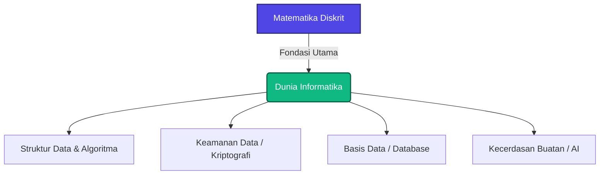
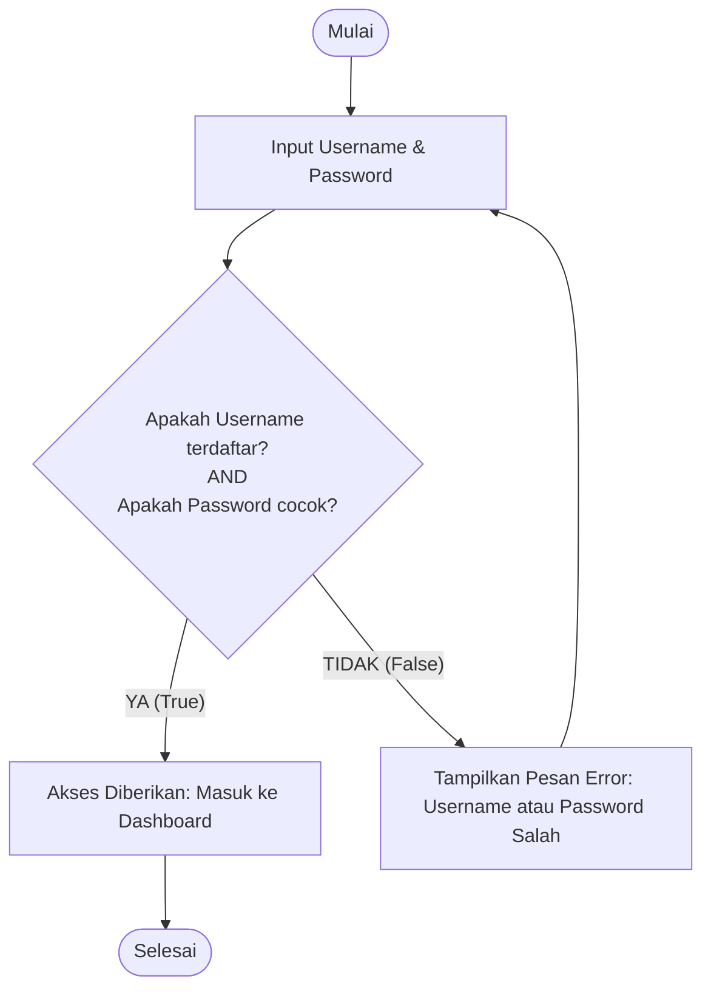

# Pertemuan 1: Pengantar Matematika Diskrit dan Logika Dasar Komputasi

Selamat datang di petualangan pertamamu di dunia **Matematika Diskrit**! 🚀
Bagi sebagian orang, mendengar kata "Matematika" mungkin membayangkan tumpukan rumus rumit dan perhitungan tanpa akhir. Namun, di dalam dunia Informatika, Matematika Diskrit adalah sesuatu yang sangat berbeda. Ia adalah "bahasa rahasia" di balik semua teknologi modern yang kita gunakan hari ini—mulai dari media sosial, game 3D, kecerdasan buatan (AI), hingga keamanan data perbankan.

Mari kita mulai perjalanan ini dengan memahami mengapa matematika ini begitu istimewa dan bagaimana ia membentuk cara berpikir seorang praktisi IT sejati.

---

## 🎯 Tujuan Pembelajaran

Setelah menyelesaikan materi pada pertemuan ini, diharapkan kamu mampu:
1. **Membedakan** konsep kontinu dan konsep diskrit dengan analogi kehidupan nyata secara tepat.
2. **Menjelaskan** hubungan erat antara Matematika Diskrit dengan disiplin ilmu Informatika/Ilmu Komputer.
3. **Mengidentifikasi** peran penting logika sebagai fondasi dasar dalam penulisan algoritma dan pemrograman komputer.
4. **Menerapkan** pola pikir komputasional (*computational thinking*) dalam menganalisis masalah logika sederhana di dunia nyata.

---

## 📚 1. Apa itu Matematika Diskrit?

Sebelum masuk ke definisi formal, mari kita ajak pikiran kita berimajinasi sejenak.

### 💡 Ilustrasi Imajinatif
> **Refleksi:**
> * *Jika konsep "kontinu" dan "diskrit" adalah benda di sekitar kita, mereka akan seperti apa?*
> * *Bagaimana cara menjelaskan perbedaan keduanya kepada anak kecil?*

Bayangkan sebuah **perosotan** di taman bermain dan sebuah **tangga** di dalam rumah:
* **Perosotan adalah representasi dari dunia "Kontinu".** Ketika kamu meluncur ke bawah, kamu melewati setiap titik ketinggian secara mulus tanpa terputus. Ketinggianmu berubah secara halus dari 2 meter, 1.99 meter, 1.9876 meter, dan seterusnya hingga mencapai 0. Nilainya tidak terbatas dan mengalir.
* **Tangga adalah representasi dari dunia "Diskrit".** Ketika kamu menaiki tangga, kamu hanya bisa berdiri di anak tangga ke-1, anak tangga ke-2, atau anak tangga ke-3. Kamu *tidak pernah* bisa berdiri di anak tangga ke-1.5 atau anak tangga ke-2.75. Setiap pijakan terpisah secara jelas, tegas, dan terhitung.

| Konsep | Analogi Fisik | Karakteristik | Contoh Matematika |
| :--- | :--- | :--- | :--- |
| **Kontinu** | Perosotan, Jam Pasir, Penggaris | Mengalir, tidak terputus, tak terhingga di antara dua titik | Bilangan Riil ($\mathbb{R}$), kalkulus, pengukuran suhu |
| **Diskrit** | Anak Tangga, Jam Digital, Kerikil | Terpisah, terhitung, memiliki batas yang jelas | Bilangan Bulat ($\mathbb{Z}$), teori graf, himpunan |

### 🔍 Penjelasan Konsep
Secara bahasa, **Diskrit** (*discrete*) berarti terpisah, berlainan, atau tidak saling berhubungan. 

Oleh karena itu, **Matematika Diskrit** adalah cabang matematika yang mengkaji objek-objek yang terpisah satu sama lain dan tidak saling berhubungan secara kontinu. 

Mengapa komputer menggunakan matematika diskrit? Karena komputer bekerja menggunakan **sistem biner**. Di dalam sirkuit komputer, informasi disimpan dalam bentuk miliaran saklar elektronik kecil (transistor) yang hanya memiliki dua kondisi diskrit:
* **ON** (Ada tegangan listrik / bernilai `1`)
* **OFF** (Tidak ada tegangan listrik / bernilai `0`)

Komputer tidak mengenal kondisi "setengah menyala" atau "hampir mati". Semuanya bersifat pasti: `0` atau `1`. Inilah mengapa Matematika Diskrit menjadi bahasa ibu bagi komputer.

---

## 🌐 2. Hubungan Matematika Diskrit dengan Informatika

Mungkin kamu bertanya-tanya: *"Kenapa anak IT harus belajar matematika ini? Bukankah kita hanya perlu belajar ngoding?"*

Mari kita lihat di balik layar program-program hebat yang biasa kita gunakan.

### 💡 Ilustrasi Imajinatif
> **Refleksi:**
> * *Jika matematika diskrit adalah sebuah adegan di balik layar pembuatan game atau aplikasi sosial media, apa yang sedang dilakukan oleh matematika tersebut?*
> * *Bentuk apa yang paling dekat untuk menggambarkan hubungan ini?*

Bayangkan Matematika Diskrit seperti **fondasi semen dan besi cakar ayam** pada sebuah gedung pencakar langit. Saat gedung itu selesai dibangun dengan indah, orang-orang hanya akan mengagumi kaca-kaca yang berkilau, lift yang cepat, dan desain interiornya yang mewah (sama seperti pengguna aplikasi yang mengagumi antarmuka/UI yang keren). 

Namun, tanpa fondasi kokoh di bawah tanah yang menahan seluruh beban bangunan, gedung tersebut akan langsung roboh ditiup angin kencang. Di dunia IT:
* **Desain UI/UX** adalah eksterior gedung yang indah.
* **Matematika Diskrit** adalah fondasi cakar ayam yang memastikan aplikasi tidak *crash*, data terkirim dengan aman, dan algoritma berjalan dengan sangat cepat.

### 🔍 Kaitan Erat dengan Bidang Informatika
Hampir setiap mata kuliah dan teknologi utama dalam dunia komputer dibangun di atas prinsip Matematika Diskrit:



1. **Struktur Data & Algoritma:** 
   Bagaimana cara Google Maps mencari rute tercepat dari rumahmu ke kampus? Google Maps melihat persimpangan jalan sebagai kumpulan titik terpisah (diskrit) yang dihubungkan oleh jalan. Konsep ini dipelajari dalam **Teori Graf** (Pertemuan 10-14).
2. **Basis Data (Database):**
   Ketika kamu mencari barang belanjaan di Shopee atau Tokopedia, sistem database mencarinya menggunakan **Teori Himpunan** (Pertemuan 5) dan **Relasi** (Pertemuan 6) untuk mencocokkan kategori barang yang kamu cari secara kilat.
3. **Kriptografi (Keamanan Siber):**
   Bagaimana pesan WhatsApp-mu tetap aman dan tidak bisa diintip orang lain? Kriptografi menggunakan teori bilangan bulat diskrit untuk mengacak pesan menjadi kode rahasia yang hanya bisa dibuka oleh penerima yang sah.
4. **Kecerdasan Buatan (Artificial Intelligence):**
   Algoritma AI menganalisis probabilitas dan kombinasi keputusan menggunakan **Kombinatorika** (Pertemuan 7) untuk memprediksi tindakan terbaik selanjutnya.

---

## ⚡ 3. Pentingnya Logika dalam Pemrograman

Logika adalah bahan bakar utama dari setiap baris kode pemrograman yang kamu tulis. Tanpa logika, komputer hanyalah sekotak besi tak berguna.

### 💡 Ilustrasi Imajinatif
> **Refleksi:**
> * *Jika logika adalah benda di dalam sirkuit komputer, ia akan seperti apa?*
> * *Bagaimana menggambarkan pentingnya logika kepada seseorang yang baru belajar pemrograman?*

Bayangkan logika pemrograman seperti **rel kereta api dan sistem persilangan jalurnya**. 
Masinis (komputer) akan menjalankan kereta dengan kecepatan penuh tanpa ragu. Tugas seorang programmer adalah membangun rel yang benar dan mengatur tuas persilangan agar kereta tersebut sampai ke stasiun tujuan dengan selamat, bukannya saling bertabrakan atau masuk ke jurang. 

Setiap percabangan rel adalah keputusan logika `IF` (Jika) dan `ELSE` (Jika tidak). Jika salah menempatkan satu tuas logika saja, seluruh kereta akan mengalami kecelakaan fatal (*error/bug*).

### 🔍 Penjelasan Konsep & Contoh Sederhana
Dalam pemrograman, komputer mengambil keputusan berdasarkan kondisi logis yang bernilai **Benar (True)** atau **Salah (False)**.

Mari kita lihat contoh sederhana dalam kehidupan sehari-hari yang kita ubah menjadi logika pemrograman (Pseudocode):

**Kasus Nyata:**
*Setiap pagi sebelum berangkat kuliah, kamu melihat keluar jendela. Jika hari hujan, kamu wajib membawa payung. Namun, jika cuaca cerah, kamu cukup memakai jaket kesayanganmu.*

**Bentuk dalam Kode Pemrograman (Pseudocode):**
```markdown
JIKA (cuaca == "Hujan") MAKA:
    Bawa "Payung"
SELAIN ITU:
    Pakai "Jaket Kesayangan"
```

Dalam kode di atas, kondisi `cuaca == "Hujan"` adalah sebuah **pernyataan logika**. Komputer akan mengevaluasi pernyataan tersebut:
* Jika cuaca memang hujan, pernyataan bernilai **TRUE** $\rightarrow$ jalankan perintah "Bawa Payung".
* Jika cuaca ternyata cerah/mendung tipis, pernyataan bernilai **FALSE** $\rightarrow$ jalankan perintah "Pakai Jaket Kesayangan".

Semua sistem cerdas, mulai dari pengkondisian AC otomatis hingga sistem kendali autopilot pesawat terbang, bekerja menggunakan rantai logika keputusan seperti ini dalam skala yang sangat besar.

---

## 🛠️ Studi Kasus Informatika: Sistem Login Pengguna

Untuk melihat bagaimana semua konsep ini bekerja sama, mari kita analisis sistem yang pasti kamu gunakan setiap hari: **Sistem Login Username dan Password**.



### Analisis Logika Studi Kasus:
Sistem login ini menggunakan **Logika Gerbang AND** (yang akan kita pelajari mendalam di Pertemuan 2). 
Agar pengguna bisa masuk ke aplikasi, ada dua kondisi diskrit yang wajib terpenuhi bersamaan:
1. Kondisi A: `Username benar` (Bernilai True/False)
2. Kondisi B: `Password cocok` (Bernilai True/False)

Aturan Logika Komputer:
> **Akses hanya diberikan jika Kondisi A AND Kondisi B menghasilkan TRUE.**

Mari kita buat tabel keputusan sederhananya:

| Username Terdaftar? (A) | Password Cocok? (B) | Hasil Logika (A AND B) | Status Akses |
| :---: | :---: | :---: | :--- |
| **FALSE** (Salah) | **FALSE** (Salah) | **FALSE** | Ditolak ❌ |
| **FALSE** (Salah) | **TRUE** (Benar) | **FALSE** | Ditolak ❌ |
| **TRUE** (Benar) | **FALSE** (Salah) | **FALSE** | Ditolak ❌ |
| **TRUE** (Benar) | **TRUE** (Benar) | **TRUE** | **Diterima!**  |

Perhatikan betapa ketatnya logika komputer. Meskipun username-mu benar, jika password-mu salah satu karakter saja, hasil logikanya langsung menjadi `FALSE`, dan pintu masuk langsung terkunci rapat demi keamanan data.

---

## 📝 Latihan Soal & Asah Computational Thinking

Jawablah pertanyaan-pertanyaan berikut untuk menguji pemahaman dan melatih kepekaan logikamu!

### 🧠 Soal Refleksi & Analogi
1. Sebutkan **tiga contoh** objek kontinu dan **tiga contoh** objek diskrit lainnya yang dapat kamu temukan di dalam kamar belajarmu saat ini!
2. Jika konsep "Keamanan Password" dianalogikan sebagai benda fisik untuk menjelaskan kepada anak kecil, benda apakah yang paling cocok menurutmu? Jelaskan alasannya!

### 💻 Soal Logika Pemrograman
3. Perhatikan potongan logika (pseudocode) berikut ini:
   ```markdown
   Nilai_Ujian = 75
   Kehadiran = 85

   JIKA (Nilai_Ujian >= 70 AND Kehadiran >= 80) MAKA:
       Hasil = "LULUS"
   SELAIN ITU:
       Hasil = "MENGULANG"
   ```
   Apakah status akhir dari mahasiswa tersebut? **LULUS** atau **MENGULANG**? Jelaskan langkah analisis logikamu!

4. Bayangkan kamu sedang merancang sistem logika untuk **Mesin Pembuat Kopi Otomatis**. Mesin hanya akan mengeluarkan kopi hangat jika:
   * Ada cangkir di tatakan, **DAN**
   * Pengguna sudah memasukkan koin uang, **DAN**
   * Pengguna sudah memilih menu kopi.
   
   Buatlah rancangan aturan logika sederhana (Pseudocode) seperti contoh di atas untuk sistem mesin kopi ini!

---

## 📌 Kesimpulan

Matematika Diskrit bukanlah sekadar kumpulan rumus kering untuk dihafal. Ia adalah **seni berpikir terstruktur dan logis** yang membedakan seorang programmer amatir dengan seorang insinyur perangkat lunak profesional. 

Dengan mempelajari matematika diskrit, kamu sedang melatih otakmu agar bisa berkomunikasi dengan komputer secara presisi, merancang struktur data yang efisien, dan memecahkan masalah kompleks dengan langkah-langkah yang terukur.

> *"Komputer mungkin dibuat dari materi fisik seperti silikon dan kabel tembaga, namun jiwanya sepenuhnya ditenagai oleh Matematika Diskrit dan Logika."*

Sampai jumpa di **Pertemuan 2**, di mana kita akan mulai membedah bahasa logika proposisional secara mendalam dan merancang tabel kebenaran kita sendiri! ⚡

---
*(buat pesan commit bahasa indonesia sederhana: "menambahkan materi kuliah pertemuan 1 tentang pengantar matematika diskrit")*
