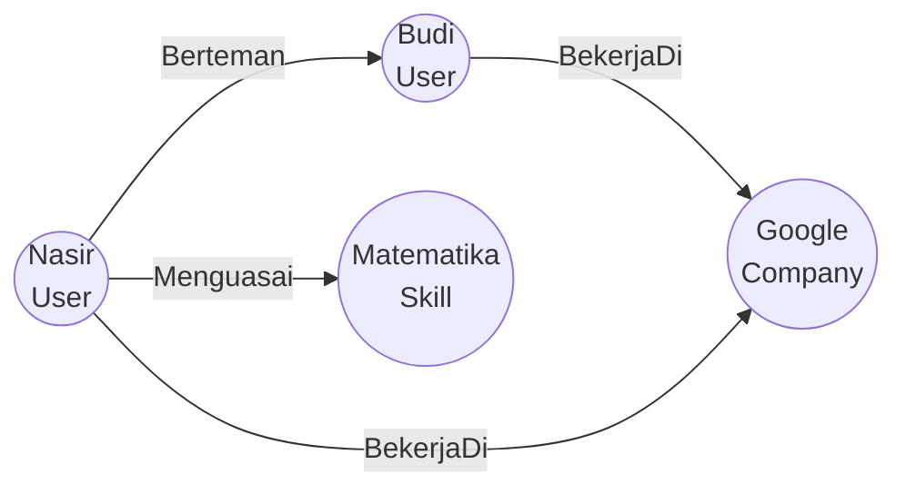

# Pertemuan 10: Pengantar Teori Graf

Selamat datang di Pertemuan 10! 🚀
Hari ini kita akan mulai menjelajahi salah satu topik paling penting, paling populer, dan paling banyak diterapkan dalam industri perangkat lunak modern: **Teori Graf** (*Graph Theory*).

Pernahkah kamu memikirkan bagaimana Google Maps mengetahui seluruh jalan di dunia dan dengan instan mencarikan rute tercepat untukmu? Bagaimana Facebook atau LinkedIn tahu bahwa seseorang mungkin adalah *"teman dari temanmu"* (rekomendasi koneksi)? Semua teknologi luar biasa ini dibangun di atas fondasi struktur data yang sama, yaitu Graf. Mari kita bedah dasar-dasarnya hari ini!

---

## 🎯 Tujuan Pembelajaran

Setelah menyelesaikan materi pada pertemuan ini, diharapkan kamu mampu:
1. **Menjelaskan** definisi formal graf beserta komponen utamanya: Simpul (*Vertex*) dan Sisi (*Edge*).
2. **Menghitung** derajat (*degree*) suatu simpul pada graf tak berarah secara tepat.
3. **Merepresentasikan** sebuah graf ke dalam bentuk **Adjacency Matrix** (Matriks Ketetanggaan) di dalam memori komputer.
4. **Merepresentasikan** graf yang sama ke dalam bentuk **Adjacency List** (Daftar Ketetanggaan) dalam representasi kode program.
5. **Menganalisis** kelebihan dan kekurangan Adjacency Matrix vs Adjacency List berdasarkan efisiensi memori.

---

## 📚 1. Apa itu Graf? Bahasa Peta dan Jaringan

Secara formal, **Graf** adalah struktur diskrit yang terdiri dari kumpulan objek yang disebut **Simpul** (*Vertex*) dan hubungan yang menghubungkan pasangan objek tersebut yang disebut **Sisi** (*Edge*). Graf dilambangkan dengan rumus:
$$G = (V, E)$$
Di mana:
* $V$ adalah Himpunan Simpul (*Vertices*) yang tidak kosong.
* $E$ adalah Himpunan Sisi (*Edges*) yang menghubungkan pasangan simpul.

### 💡 Ilustrasi Imajinatif
> **Refleksi:**
> * *Jika graf adalah sebuah sistem transportasi publik kereta bawah tanah (MRT), bagaimana kamu mengidentifikasi bagian-bagiannya?*
> * *Bagaimana menggambarkan graf kepada anak kecil yang suka bermain media sosial?*

Bayangkan graf seperti **peta rute MRT Jakarta** atau **jaringan pertemanan Instagram**:
1. **Simpul (Vertex - $V$):** Ini adalah stasiun-stasiun kereta (Stasiun Lebak Bulus, Blok M, Bundaran HI) atau akun-akun profil pengguna (akun Nasir, Budi, Clara). Mereka adalah titik-titik jangkar dari sistem.
2. **Sisi (Edge - $E$):** Ini adalah rel kereta fisik yang menghubungkan satu stasiun langsung ke stasiun lainnya, atau hubungan pertemanan timbal-balik di media sosial. Sisi adalah garis penghubung antar titik.

```
       [ Nasir (V1) ] -------------- [ Clara (V2) ]
             \                             /
              \                           /
               \                         /
                \                       /
                 \                     /
                  [ Budi (V3) ] ------+
```
Pada gambar di atas:
* Himpunan Simpul $V = \{\text{Nasir, Clara, Budi}\}$
* Himpunan Sisi $E = \{(\text{Nasir, Clara}), (\text{Nasir, Budi}), (\text{Budi, Clara})\}$

---

## 📚 2. Representasi Graf di Memori Komputer

Komputer tidak bisa melihat gambar lingkaran dan garis secara visual. Komputer hanya mengerti angka, baris, dan kolom di memori. Oleh karena itu, kita harus menerjemahkan graf menjadi bentuk struktur data numerik. Ada dua cara utama untuk melakukan ini:

### 1. Adjacency Matrix (Matriks Ketetanggaan)
Ini adalah tabel 2 dimensi berukuran $N \times N$ (di mana $N$ adalah jumlah simpul).
* Baris dan kolom mewakili simpul-simpul graf.
* Nilai sel bernilai `1` jika ada sisi yang menghubungkan simpul baris ke simpul kolom, dan bernilai `0` jika tidak ada koneksi.

Mari kita lihat representasi matriks untuk graf pertemanan Nasir, Clara, dan Budi di atas:

| | Nasir | Clara | Budi |
| --- | :---: | :---: | :---: |
| **Nasir** | 0 | 1 | 1 |
| **Clara** | 1 | 0 | 1 |
| **Budi** | 1 | 1 | 0 |

*Kelebihan:* Sangat cepat untuk mengecek apakah dua simpul terhubung langsung atau tidak (cukup cek indeks array 2D `matrix[i][j]` dengan kompleksitas waktu $O(1)$).
*Kekurangan:* Boros memori jika graf memiliki sedikit koneksi (*sparse graph*) karena kita harus menyiapkan tabel raksasa yang sebagian besar berisi angka `0`.

---

### 2. Adjacency List (Daftar Ketetanggaan)
Representasi ini menggunakan daftar (*list*) untuk setiap simpul, yang mencatat siapa saja simpul tetangga yang terhubung langsung dengannya.

Mari kita ubah graf di atas menjadi Adjacency List:
* **Nasir** $\rightarrow$ `["Clara", "Budi"]`
* **Clara** $\rightarrow$ `["Nasir", "Budi"]`
* **Budi**  $\rightarrow$ `["Nasir", "Clara"]`

Dalam pemrograman (misal JavaScript/Python), ini direpresentasikan menggunakan Map atau Dictionary:
```javascript
const adjacencyList = {
    "Nasir": ["Clara", "Budi"],
    "Clara": ["Nasir", "Budi"],
    "Budi":  ["Nasir", "Clara"]
};
```
*Kelebihan:* Sangat hemat memori karena kita hanya menyimpan koneksi yang benar-benar ada (sangat cocok untuk *sparse graph*).
*Kekurangan:* Lebih lambat untuk mencari tahu apakah simpul A terhubung ke simpul B karena kita harus melakukan pencarian iteratif di dalam list simpul tersebut ($O(\text{degree})$).

---

## 🛠️ Studi Kasus Informatika: Implementasi Struktur Graf di LinkedIn & Database Graf Neo4j

Dalam dunia industri perangkat lunak modern, database relasional tradisional (seperti MySQL) sangat lambat ketika harus menangani pencarian relasi bertingkat yang rumit (seperti mencari koneksi derajat ke-2 atau ke-3 di LinkedIn). 

Oleh karena itu, industri menciptakan **Graph Database** khusus seperti **Neo4j** yang menyimpan data langsung dalam bentuk Simpul dan Sisi di tingkat penyimpanan fisik.



Di LinkedIn, struktur graf ini digunakan secara masif:
* **Simpul (Vertex):** Dapat bertipe `User`, `Company`, atau `Skill`.
* **Sisi (Edge):** Dapat bertipe `FRIEND_WITH`, `WORKS_AT`, atau `SKILLED_IN`.

Dengan pemodelan graf ini, query untuk mencari rekomendasi pekerjaan berdasarkan teman yang bekerja di perusahaan yang sama dapat diselesaikan dalam hitungan milidetik, meningkatkan pengalaman pengguna secara signifikan.

---

## 📝 Latihan Soal & Asah Computational Thinking

### 🧠 Soal 1: Analisis Derajat Graf tak Berarah
Perhatikan graf sederhana berikut yang terdiri dari 4 simpul ($A, B, C, D$) dan memiliki sisi-sisi sebagai berikut:
$$V = \{A, B, C, D\}$$
$$E = \{(A, B), (A, C), (B, C), (C, D)\}$$

1. Gambarlah graf tersebut secara visual!
2. Hitunglah derajat (*degree*) masing-masing simpul!
   * $\text{deg}(A) = \dots$
   * $\text{deg}(B) = \dots$
   * $\text{deg}(C) = \dots$
   * $\text{deg}(D) = \dots$
3. Buktikan **Teori Jabat Tangan** (*Handshaking Lemma*) yang menyatakan bahwa jumlah derajat seluruh simpul pada graf adalah dua kali jumlah sisinya!
   $$\sum \text{deg}(v) = 2 \times |E|$$

### 📝 Soal 2: Representasi Memori
Berdasarkan gambar graf yang telah kamu buat pada Soal 1:
1. Tuliskan representasi **Adjacency Matrix**-nya secara lengkap!
2. Tuliskan representasi **Adjacency List**-nya!

### 💻 Soal 3: Implementasi Struktur Graf dalam Kode Program
Buatlah representasi graf pada Soal 1 ke dalam kode program sederhana menggunakan bahasa **JavaScript** atau **Python** menggunakan format Adjacency List (Dictionary/Map)! Tuliskan kodenya secara rapi!

---

## 📌 Kesimpulan

Teori Graf adalah struktur data revolusioner yang membebaskan kita dari keterbatasan tabel data baris dan kolom yang kaku. Dengan memodelkan dunia nyata sebagai simpul dan hubungan antar simpul, kita mampu memecahkan masalah navigasi jalan, pemodelan jaringan komputer, analisis media sosial, hingga mesin rekomendasi e-commerce dengan cara yang sangat efisien dan intuitif.

> *"Dunia ini tidak terdiri dari kotak-kotak terisolasi, melainkan jaring laba-laba koneksi yang indah. Graf adalah cermin matematika dari konektivitas dunia tersebut."*

Sampai jumpa di **Pertemuan 11**, di mana kita akan mempelajari jenis-jenis graf yang lebih spesifik seperti graf berarah dan graf berbobot! ⚡

---
*(buat pesan commit bahasa indonesia sederhana: "menambahkan materi kuliah pertemuan 10 tentang pengantar teori graf")*
