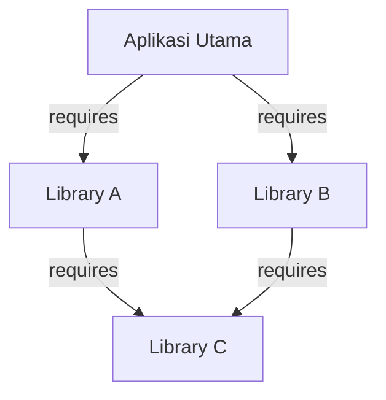

# Pertemuan 11: Jenis Graf dan Implementasinya

Selamat datang di Pertemuan 11! 🚀
Pada pertemuan sebelumnya, kita telah mempelajari dasar-dasar graf tak berarah. Namun, dunia nyata memiliki hubungan yang jauh lebih spesifik: ada hubungan yang hanya berjalan satu arah, ada jalan yang memiliki jarak lebih jauh dari jalan lainnya, dan ada jaringan di mana semua titik saling terhubung erat.

Hari ini kita akan mempelajari jenis-jenis graf yang dirancang khusus untuk memodelkan skenario kompleks tersebut: **Graf Berarah** (*Directed Graph*), **Graf Berbobot** (*Weighted Graph*), dan **Graf Lengkap** (*Complete Graph*). Kita juga akan melihat bagaimana package manager modern seperti `npm` (Node.js) atau `pip` (Python) menggunakan struktur graf berarah ini untuk mengelola dependensi library secara otomatis.

---

## 🎯 Tujuan Pembelajaran

Setelah menyelesaikan materi pada pertemuan ini, diharapkan kamu mampu:
1. **Membedakan** antara graf berarah (directed) dengan graf tak berarah (undirected) berdasarkan aturan hubungannya secara kritis.
2. **Merepresentasikan** graf berbobot (weighted) ke dalam bentuk representasi matriks dan daftar ketetanggaan dengan benar.
3. **Menghitung** jumlah sisi maksimum pada graf lengkap ($K_n$) berdasarkan rumus matematika yang tepat.
4. **Menerapkan** pemodelan graf berarah asiklik (Directed Acyclic Graph - DAG) untuk memecahkan masalah urutan eksekusi tugas (*dependency resolution*).

---

## 📚 1. Membedah Jenis-Jenis Graf

Mari kita perjelas tiga jenis graf utama yang sering kita temukan di industri komputasi:

### 1. Graf Berarah (Directed Graph / Digraph)
Graf di mana setiap sisi memiliki arah panah yang jelas dari simpul asal ke simpul tujuan.
* **Analogi Instagram:** Jika Nasir mem-follow Clara ($Nasir \rightarrow Clara$), tidak otomatis Clara mem-follow Nasir balik. Arah hubungan bersifat asimetris.
* **Analogi Jalan Satu Arah:** Sisi menggambarkan jalan searah di perkotaan. Kamu hanya bisa melintas dari A ke B, tidak bisa sebaliknya.

### 2. Graf Berbobot (Weighted Graph)
Graf di mana setiap sisi memiliki nilai angka (bobot) tertentu yang melambangkan jarak, biaya, waktu tempuh, atau kapasitas.
* **Analogi Google Maps:** Sisi penghubung antar kota tidak hanya garis biasa; ia memiliki bobot berupa jarak fisik (misal: Jakarta ke Bandung berbobot 150 km) atau waktu tempuh (berbobot 120 menit).

```
   [ Jakarta ] -----( 150 km )-----> [ Bandung ]
        \                                /
      ( 60 km )                       ( 90 km )
          \                              /
           +-----> [ Bogor ] -----------+
```

### 3. Graf Lengkap (Complete Graph - $K_n$)
Graf sederhana tak berarah di mana **setiap simpul terhubung langsung ke semua simpul lainnya** tanpa kecuali. Graf lengkap dengan $n$ simpul dilambangkan dengan $K_n$.
* **Analogi Konferensi Meja Bundar:** Jika ada 5 delegasi negara duduk melingkar, dan mereka semua saling berjabat tangan satu-satu secara komprehensif, jaringan jabat tangan yang terbentuk adalah graf lengkap $K_5$.
* **Jumlah Sisi Maksimum Graf Lengkap ($K_n$):**
  $$\text{Jumlah Sisi} = \frac{n(n-1)}{2}$$

---

## 📚 2. Representasi Graf Berbobot dan Berarah di Memori

Bagaimana kita menyimpan graf berarah dan berbobot di dalam memori komputer?

### 1. Representasi Adjacency Matrix (Graf Berbobot)
Jika pada graf biasa kita mengisi sel dengan `1` (terhubung) atau `0` (tidak terhubung), maka pada graf berbobot kita mengisi sel langsung dengan **nilai bobotnya**. Jika tidak terhubung, kita mengisinya dengan simbol tak hingga ($\infty$) atau angka `0`/`null` tergantung konvensi program.

Mari kita representasikan peta Jakarta, Bandung, Bogor di atas ke dalam matriks (baris asal $\rightarrow$ kolom tujuan):

| Dari \ Ke | Jakarta | Bandung | Bogor |
| --- | :---: | :---: | :---: |
| **Jakarta** | 0 | 150 | 60 |
| **Bandung** | null | 0 | null |
| **Bogor** | null | 90 | 0 |

---

### 2. Representasi Adjacency List (Graf Berarah & Berbobot)
Dalam daftar ketetanggaan, kita menyimpan tetangga sekaligus dengan bobot sisinya dalam bentuk objek pasang-nilai (*key-value*).

```javascript
const weightedGraph = {
    "Jakarta": [ { node: "Bandung", weight: 150 }, { node: "Bogor", weight: 60 } ],
    "Bandung": [],
    "Bogor":   [ { node: "Bandung", weight: 90 } ]
};
```

---

## 🛠️ Studi Kasus Informatika: Resolusi Dependensi pada Package Manager (npm / pip)

Pernahkah kamu menjalankan perintah `npm install react` atau `pip install tensorflow`? Package manager tersebut secara instan men-download library utama beserta puluhan library pendukung lainnya yang dibutuhkan.

Bagaimana cara komputer menentukan library mana yang harus di-download dan di-install terlebih dahulu agar tidak memicu error?



### Pemodelan Graf:
Package manager memodelkan hubungan ini sebagai **Directed Acyclic Graph (DAG)**—graf berarah tanpa siklus melingkar:
* **Simpul (Vertex):** Library / Package.
* **Sisi Berarah (Edge):** Hubungan dependensi (kebutuhan). Panah dari $A \rightarrow C$ berarti library $A$ membutuhkan library $C$.

### Algoritma Resolusi:
Berdasarkan graf di atas, library $C$ berada di tingkat paling dasar (tidak memiliki ketergantungan keluar). Oleh karena itu, komputer menarik kesimpulan:
1. **Langkah 1:** Install library $C$ terlebih dahulu.
2. **Langkah 2:** Install library $A$ dan $B$ (karena kebutuhan mereka akan $C$ sudah terpenuhi).
3. **Langkah 3:** Terakhir, install aplikasi utama.

Jika terjadi **Circular Dependency** (misal $A$ butuh $B$, $B$ butuh $C$, dan $C$ butuh $A$), sistem akan mendeteksi adanya siklus (loop) pada graf berarah dan segera menghentikan proses instalasi dengan memicu pesan error agar sistem tidak terjebak dalam instalasi tanpa akhir.

---

## 📝 Latihan Soal & Asah Computational Thinking

### 🧠 Soal 1: Perhitungan Graf Lengkap
Sebuah server cloud perusahaan menghubungkan **6 pusat data regional** di seluruh Indonesia secara langsung satu sama lain tanpa perantara (membentuk topologi *fully-connected mesh*).
1. Gambarlah skema jaringan koneksi pusat data ini secara visual (membentuk graf lengkap $K_6$)!
2. Hitunglah berapa banyak kabel fiber optik utama yang harus disediakan perusahaan untuk menghubungkan seluruh pusat data tersebut secara langsung menggunakan rumus sisi graf lengkap!

### 📝 Soal 2: Representasi Graf Berarah dan Berbobot
Diberikan deskripsi graf berarah dan berbobot sebagai berikut:
* Simpul: $V = \{1, 2, 3, 4\}$
* Sisi berarah dan bobotnya: 
  * Dari simpul 1 ke 2 dengan bobot 10
  * Dari simpul 1 ke 3 dengan bobot 5
  * Dari simpul 2 ke 4 dengan bobot 8
  * Dari simpul 3 ke 2 dengan bobot 3
  * Dari simpul 3 ke 4 dengan bobot 2
  * Dari simpul 4 ke 1 dengan bobot 7

1. Gambarlah graf tersebut secara visual lengkap dengan panah arah dan angka bobotnya!
2. Tuliskan representasi **Adjacency Matrix**-nya!
3. Tuliskan representasi **Adjacency List**-nya!

### 💻 Soal 3: Studi Kasus Circular Dependency Detector
Bayangkan kamu sedang merancang compiler untuk bahasa pemrograman baru. Kamu memiliki tiga modul kode: Modul A, Modul B, dan Modul C.
* Modul A mengimpor fungsi dari Modul B ($A \rightarrow B$).
* Modul B mengimpor fungsi dari Modul C ($B \rightarrow C$).
* Modul C mengimpor fungsi dari Modul A ($C \rightarrow A$).

Jelaskan mengapa struktur impor di atas memicu masalah *Circular Dependency* menggunakan pendekatan teori graf berarah! Apa dampak buruknya bagi compiler jika hal ini dibiarkan?

---

## 📌 Kesimpulan

Mengetahui jenis-jenis graf membantu kita memilih model matematika yang paling akurat untuk memecahkan masalah industri. Graf berarah memberi tahu kita arah aliran data, graf berbobot mengukur efisiensi biaya/jarak dari rute tersebut, dan graf lengkap menggambarkan kapasitas maksimum koneksi. Menguasai pemodelan graf ini adalah ciri utama seorang insinyur perangkat lunak tingkat lanjut (*senior software engineer*).

> *"Komputer tidak hanya menyelesaikan masalah secara linear. Dengan graf berbobot dan berarah, ia mampu menavigasi kompleksitas rute dunia nyata dengan keanggunan matematis."*

Sampai jumpa di **Pertemuan 12**, di mana kita akan mempelajari jenis graf khusus tanpa siklus yang memodelkan hierarki data: **Pohon (Tree)**! ⚡

---
*(buat pesan commit bahasa indonesia sederhana: "menambahkan materi kuliah pertemuan 11 tentang jenis-jenis graf")*
