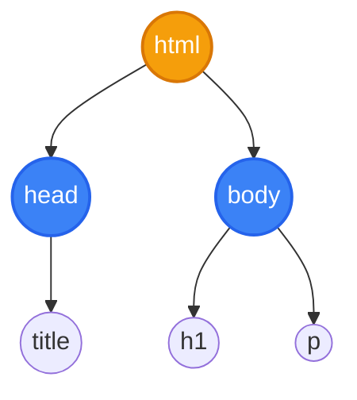

# Pertemuan 12: Pohon (Tree) dan Struktur Hierarki Data

Selamat datang di Pertemuan 12! 🚀
Setelah mendalami berbagai jenis graf, hari ini kita akan mempelajari jenis graf khusus yang sangat tertib, rapi, dan tidak memiliki jalur melingkar (siklus). Graf khusus ini disebut **Pohon** (*Tree*).

Pernahkah kamu memikirkan bagaimana Windows atau macOS mengatur folder file di komputermu secara rapi bertingkat? Bagaimana browser web membaca baris-baris kode HTML-mu dan mengubahnya menjadi halaman web interaktif? Semuanya dikelola menggunakan struktur pohon. Mari kita bedah bagaimana struktur data hierarki ini bekerja dan bagaimana cara menjelajahi cabang-cabangnya secara matematis!

---

## 🎯 Tujuan Pembelajaran

Setelah menyelesaikan materi pada pertemuan ini, diharapkan kamu mampu:
1. **Menjelaskan** definisi formal pohon (tree) sebagai graf terhubung yang tidak mengandung sirkuit/siklus.
2. **Mengidentifikasi** berbagai istilah anatomi pohon (Root, Parent, Child, Leaf, Height, Sibling) dari suatu diagram pohon secara tepat.
3. **Menggambar** struktur Pohon Biner (*Binary Tree*) berdasarkan deskripsi datanya secara mandiri.
4. **Melakukan** teknik penelusuran (*tree traversal*) menggunakan metode Preorder, Inorder, dan Postorder secara akurat.
5. **Menghubungkan** konsep pohon dengan representasi Document Object Model (DOM) pada halaman web HTML.

---

## 📚 1. Anatomi Pohon: Struktur Hierarki Data

Secara matematis, **Pohon (Tree)** adalah graf terhubung tak berarah yang tidak mengandung sirkuit (siklus). Jika graf adalah jaring laba-laba yang bebas bertumpukan, maka pohon adalah struktur keluarga yang sangat disiplin ke bawah.

### 💡 Ilustrasi Imajinatif
> **Refleksi:**
> * *Jika pohon di komputer dianalogikan sebagai sistem silsilah keluarga atau sistem folder komputer, bagaimana pembagian tugasnya?*

Bayangkan struktur folder di dalam komputermu:
1. **Root (Akar):** Ini adalah folder utama paling atas, yaitu Drive `C:\`. Ia tidak memiliki folder induk di atasnya. Semua folder lain berasal dari titik ini.
2. **Parent & Child (Induk & Anak):** Jika di dalam folder `C:\Users\` terdapat subfolder `C:\Users\Nasir\`, maka folder `Users` bertindak sebagai **Parent** (Induk) dan folder `Nasir` bertindak sebagai **Child** (Anak).
3. **Leaf (Daun):** Ini adalah file-file akhir di ujung folder, seperti file `tugas.docx` atau `foto.jpg`. File ini tidak bisa dibuka lagi untuk diisi subfolder/file lain (tidak memiliki anak). Di dalam struktur pohon, titik akhir ini disebut **Daun**.
4. **Height/Depth (Tinggi/Kedalaman):** Seberapa dalam kamu harus mengklik folder masuk ke dalam untuk menemukan file tersebut (jumlah tingkatan level).

```
                 [ Drive C:\ (ROOT) ]
                     /          \
            [ Windows ]        [ Users ]
                               /       \
                        [ Nasir ]     [ Budi ]
                            |            |
                      [ tugas.docx ]   [ game.exe ]
                         (LEAF)           (LEAF)
```

---

## 📚 2. Pohon Biner dan Seni Menjelajahinya (Tree Traversal)

Jenis pohon yang paling populer dalam ilmu komputer adalah **Pohon Biner** (*Binary Tree*). Pohon biner adalah pohon berakar di mana setiap simpul induk **maksimal hanya boleh memiliki 2 anak** (biasanya disebut Anak Kiri / *Left Child* dan Anak Kanan / *Right Child*).

Bagaimana komputer membaca seluruh data yang tersebar di cabang-cabang pohon biner ini? Komputer melakukannya melalui metode **Tree Traversal** (Penelusuran Pohon). Ada 3 cara penelusuran terstruktur:

```
            [ A ]
           /     \
        [ B ]   [ C ]
```

### 1. Preorder (Root $\rightarrow$ Kiri $\rightarrow$ Kanan)
Komputer mengunjungi simpul induk terlebih dahulu, baru meluncur ke anak kiri, kemudian anak kanan.
* Aturan: Kunjungi Root, lalu telusuri subpohon kiri, lalu telusuri subpohon kanan.
* Hasil dari pohon di atas: **A, B, C**

### 2. Inorder (Kiri $\rightarrow$ Root $\rightarrow$ Kanan)
Komputer menyapu dari kiri bawah, naik ke induk, baru ke kanan.
* Aturan: Telusuri subpohon kiri, kunjungi Root, lalu telusuri subpohon kanan.
* Hasil dari pohon di atas: **B, A, C**

### 3. Postorder (Kiri $\rightarrow$ Kanan $\rightarrow$ Root)
Komputer mengamankan anak-anaknya terlebih dahulu di bawah, baru mengunjungi simpul induknya terakhir.
* Aturan: Telusuri subpohon kiri, telusuri subpohon kanan, kunjungi Root.
* Hasil dari pohon di atas: **B, C, A**

---

## 🛠️ Studi Kasus Informatika: Document Object Model (DOM) pada Browser Web

Bagi kamu yang menyukai pemrograman web frontend, konsep pohon adalah jantung pertahanan halaman webmu. Ketika browser membaca file HTML, browser secara otomatis menyusun struktur tag HTML tersebut ke dalam memori komputer sebagai pohon raksasa yang disebut **Document Object Model (DOM)**.

### Contoh Kode HTML:
```html
<html>
  <head>
    <title>My Web</title>
  </head>
  <body>
    <h1>Selamat Datang</h1>
    <p>Halo dunia!</p>
  </body>
</html>
```

### Struktur Pohon DOM yang Terbentuk:



### Mengapa representasi pohon ini penting?
Karena dengan menyusun tag HTML sebagai pohon, bahasa pemrograman **JavaScript** dapat dengan sangat mudah memanipulasi halaman web secara dinamis:
* JavaScript bisa mencari simpul tertentu (misal: `document.querySelector("p")`).
* JavaScript bisa menghapus daun atau menambahkan anak baru secara instan (misal menambahkan element teks baru di bawah tag `body`).

---

## 📝 Latihan Soal & Asah Computational Thinking

### 🧠 Soal 1: Istilah Anatomi Pohon
Perhatikan diagram pohon biner berikut:

```
            [ M ]
           /     \
        [ N ]   [ O ]
       /     \
    [ P ]   [ Q ]
```

Berdasarkan diagram pohon di atas, tentukan:
1. Simpul manakah yang bertindak sebagai **Root**?
2. Simpul manakah yang bertindak sebagai **Leaf** (Daun)?
3. Siapakah **Parent** dari simpul P?
4. Siapakah **Sibling** (Saudara Kandung) dari simpul Q?
5. Berapakah **Tinggi (Height)** dari pohon tersebut?

### 📝 Soal 2: Latihan Tree Traversal
Berdasarkan gambar pohon biner pada Soal 1, tuliskan secara urut simpul-simpul hasil penelusuran menggunakan metode:
1. **Preorder Traversal**
2. **Inorder Traversal**
3. **Postorder Traversal**

### 💻 Soal 3: Studi Kasus Expression Tree (Pohon Ekspresi)
Komputer mengevaluasi rumus matematika menggunakan pohon ekspresi. Sebuah pohon ekspresi biner dirancang untuk rumus matematika berikut:
$$(5 + 3) \times 2$$

Di dalam pohon ekspresi, operator aritmatika ($+$, $-$, $\times$, $/$) diletakkan sebagai simpul internal (induk), sedangkan angka diletakkan sebagai daun.
1. Gambarlah diagram pohon biner yang tepat untuk merepresentasikan rumus $(5 + 3) \times 2$!
2. Jika pohon tersebut ditelusuri menggunakan **Postorder Traversal**, tuliskan urutan hasilnya! (Hasil ini dikenal di ilmu komputer sebagai notasi *Reverse Polish Notation* / RPN yang digunakan oleh kalkulator).

---

## 📌 Kesimpulan

Pohon adalah struktur data hierarkis terpenting dalam rekayasa perangkat lunak. Mulai dari pengaturan sistem berkas di komputer, pemetaan kode HTML sebagai DOM oleh browser, pencarian kata cepat pada kamus digital, hingga evaluasi rumus matematika kompleks oleh compiler—semuanya bergantung pada efisiensi navigasi cabang pohon. Menguasai pohon biner dan metode penelusurannya membuka pintu pemahamanmu terhadap struktur data tingkat lanjut.

> *"Kehidupan bermula dari akar yang kokoh, lalu bercabang dengan teratur menghasilkan daun-daun keputusan yang indah. Struktur pohon adalah seni keteraturan data."*

Sampai jumpa di **Pertemuan 13**, di mana kita akan mempelajari algoritma pencarian rute terpendek pada graf: **BFS, DFS, dan Algoritma Dijkstra**! ⚡

---
*(buat pesan commit bahasa indonesia sederhana: "menambahkan materi kuliah pertemuan 12 tentang pohon dan struktur data hierarki")*
