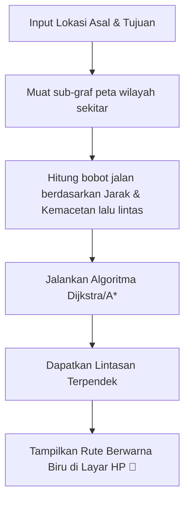

# Pertemuan 13: Algoritma Graf dan Jalur Terpendek

Selamat datang di Pertemuan 13! 🚀
Setelah kita mampu memodelkan data menggunakan graf dan pohon, hari ini kita akan mempelajari kecerdasan utama yang membuat graf tersebut "hidup". Kita akan membahas algoritma navigasi: **Breadth-First Search (BFS)**, **Depth-First Search (DFS)**, dan legenda pencarian lintasan terpendek, **Algoritma Dijkstra**.

Pernahkah kamu kagum melihat betapa cepatnya Google Maps merekomendasikan rute alternatif saat kamu salah berbelok arah di jalan raya? Bagaimana sistem game canggih mengendalikan musuh (AI) agar bisa mengejarmu melewati labirin rintangan? Semua kepintaran navigasi ini ditenagai oleh algoritma pencarian graf yang akan kita bedah hari ini!

---

## 🎯 Tujuan Pembelajaran

Setelah menyelesaikan materi pada pertemuan ini, diharapkan kamu mampu:
1. **Membedakan** karakteristik strategi pencarian melebar (BFS) dengan pencarian mendalam (DFS) secara konseptual.
2. **Menelusuri** urutan simpul yang dikunjungi pada graf menggunakan metode BFS (dengan bantuan struktur Queue) dan DFS (dengan bantuan struktur Stack).
3. **Menerapkan** Algoritma Dijkstra untuk menghitung lintasan terpendek dari satu titik asal (*single-source shortest path*) pada graf berbobot positif secara manual menggunakan tabel penelusuran.
4. **Menghubungkan** algoritma graf dengan fitur komputasi nyata seperti pencari rute GPS dan sistem rekomendasi pertemanan media sosial.

---

## 📚 1. Menjelajahi Graf: BFS vs DFS

Sebelum kita mencari rute terpendek, kita harus tahu bagaimana cara menjelajahi seluruh sudut graf tanpa tersesat. Ada dua strategi pencarian utama:

```
          [ A (Asal) ]
           /        \
        [ B ]      [ C ]
       /               \
    [ D ]             [ E ]
```

### 1. Breadth-First Search (BFS) - Pencarian Melebar 🌊
BFS menjelajahi graf lapis demi lapis secara mendatar. Ia mengunjungi seluruh tetangga terdekatnya terlebih dahulu, baru melangkah ke tetangga yang lebih jauh.
* **💡 Ilustrasi Imajinatif:** Bayangkan kamu **menyiramkan seember air di lantai datar**. Air akan mengalir keluar menyebar merata membentuk lingkaran konsentris ke samping terlebih dahulu, membasahi seluruh area terdekat sebelum mencapai sudut terjauh.
* **Cara Kerja Komputer:** BFS menggunakan bantuan struktur data antrean **Queue (FIFO - First In First Out)**.
* **Urutan Kunjungan Graf di Atas:** **A, B, C, D, E** (Simpul A derajat 0, simpul B dan C derajat 1, simpul D dan E derajat 2).
* **Kegunaan Nyata:** Mencari hubungan derajat pertemanan terdekat (Mutual friends) di media sosial.

---

### 2. Depth-First Search (DFS) - Pencarian Mendalam 🕳️
DFS menjelajahi graf dengan langsung meluncur menyusuri satu cabang sedalam-dalamnya hingga mentok ke ujung mati, baru melangkah mundur (*backtrack*) untuk mencoba cabang persimpangan lainnya.
* **💡 Ilustrasi Imajinatif:** Bayangkan kamu sedang **menjelajahi labirin gelap dan sempit**. Kamu memegang obor dan menyusuri satu tembok sebelah kanan terus-menerus ke dalam hingga menemukan jalan buntu. Baru kemudian kamu melangkah mundur perlahan dan berbelok ke persimpangan alternatif pertama yang kamu lewati tadi.
* **Cara Kerja Komputer:** DFS menggunakan bantuan struktur data tumpukan **Stack (LIFO - Last In First Out)** atau fungsi rekursif.
* **Urutan Kunjungan Graf di Atas:** **A, B, D, C, E** (Langsung menyelam dari A $\rightarrow$ B $\rightarrow$ D, mentok, backtrack ke A, lalu menyelam ke C $\rightarrow$ E).
* **Kegunaan Nyata:** Memecahkan labirin (*maze solving*) atau menganalisis seluruh kemungkinan langkah bidak catur di masa depan.

---

## 📚 2. Algoritma Dijkstra: Sang Pemburu Rute Tercepat

Jika graf memiliki bobot sisi yang melambangkan jarak, kita tidak bisa hanya menggunakan BFS biasa untuk mencari lintasan terpendek. Kita membutuhkan **Algoritma Dijkstra**, sebuah algoritma cerdas yang ditemukan oleh ilmuwan komputer legendaris Edsger W. Dijkstra pada tahun 1956.

### 💡 Ilustrasi Imajinatif
> **Refleksi:**
> * *Jika algoritma Dijkstra adalah anjing pelacak yang mencari aroma makanan, bagaimana ia bergerak?*

Bayangkan algoritma Dijkstra seperti **anjing pelacak yang sangat cerdas**. Ia dilepas di simpul awal dengan misi mencari jalur tercepat menuju simpul harta karun. 

Anjing ini dibekali buku catatan kecil untuk menuliskan total jarak terpendek sementara ke setiap pos pemeriksaan kota. Setiap kali anjing melangkah ke pos baru, ia mengendus jalan di depan, menghitung total energi yang dibutuhkan dari titik awal, dan jika ia menemukan rute alternatif yang lebih hemat energi daripada yang tercatat di bukunya, ia langsung mencoret catatan lama dan memperbaruinya dengan rute baru yang lebih murah (*relaxing edge*). Ia selalu memilih melangkah ke pos pemeriksaan berikutnya yang memiliki nilai total jarak terkecil (*greedy choice*).

### 🔍 Langkah Evaluasi Dijkstra (Contoh Kasus)

Diberikan graf berbobot berikut:
* Simpul: $A$ (Asal), $B$, $C$, $D$ (Tujuan)
* Sisi berbobot: 
  * $A \rightarrow B$ = 4
  * $A \rightarrow C$ = 2
  * $C \rightarrow B$ = 1
  * $B \rightarrow D$ = 3
  * $C \rightarrow D$ = 8

Mari kita cari rute terpendek dari $A$ ke $D$ menggunakan tabel penelusuran Dijkstra:

1. **Inisialisasi Jarak Awal:**
   * Jarak ke $A = 0$
   * Jarak ke simpul lain ($B, C, D$) = $\infty$ (Tak terhingga)
   * Simpul aktif saat ini: $A$

2. **Langkah 1 (Evaluasi Tetangga A):**
   * Tetangga $A$ adalah $B$ dan $C$.
   * Jarak baru ke $B = 0 + 4 = 4$ (Lebih kecil dari $\infty$, update!)
   * Jarak baru ke $C = 0 + 2 = 2$ (Lebih kecil dari $\infty$, update!)
   * Kunjungi simpul dengan jarak terkecil berikutnya: **Simpul C** (Jarak = 2).

3. **Langkah 2 (Evaluasi Tetangga C):**
   * Tetangga $C$ adalah $B$ dan $D$.
   * Jarak alternatif ke $B$ lewat $C = 2 + 1 = 3$. 
     *(Bandingkan dengan catatan lama ke B yaitu 4. Karena 3 lebih murah, update jarak B menjadi 3!)*
   * Jarak baru ke $D$ lewat $C = 2 + 8 = 10$. (Update!)
   * Kunjungi simpul belum dikunjungi dengan jarak terkecil berikutnya: **Simpul B** (Jarak = 3).

4. **Langkah 3 (Evaluasi Tetangga B):**
   * Tetangga $B$ adalah $D$.
   * Jarak alternatif ke $D$ lewat $B = 3 + 3 = 6$.
     *(Bandingkan dengan catatan lama ke D yaitu 10. Karena 6 jauh lebih kecil, update jarak D menjadi 6!)*
   * Semua simpul telah dievaluasi.

**Hasil Akhir Rute Terpendek:**
* Lintasan terpendek dari $A$ ke $D$ adalah **A $\rightarrow$ C $\rightarrow$ B $\rightarrow$ D** dengan **total bobot = 6**. 
*(Perhatikan bahwa rute langsung A $\rightarrow$ B $\rightarrow$ D berbobot 7, dan rute A $\rightarrow$ C $\rightarrow$ D berbobot 10. Dijkstra berhasil menemukan rute memutar yang justru paling hemat!)*

---

## 🛠️ Studi Kasus Informatika: Sistem Navigasi GPS pada Google Maps

Google Maps menampung miliaran simpul persimpangan jalan dan sisi jalan di seluruh dunia. Ketika kamu meminta rute dari rumah ke mall, server Google Maps memanggil variasi dari **Algoritma Dijkstra** yang telah dioptimasi (seperti algoritma $A^*$ / A-Star):



Bobot sisi pada Google Maps tidak statis. Ia berubah setiap menit secara dinamis berdasarkan data kemacetan lalu lintas riil yang dikirimkan oleh sensor GPS HP para pengguna di jalan raya. Hal ini menjamin rute yang kamu dapatkan selalu merupakan rute tercepat pada detik tersebut.

---

## 📝 Latihan Soal & Asah Computational Thinking

### 🧠 Soal 1: Perbedaan BFS vs DFS
Jelaskan perbedaan mendasar antara algoritma BFS dan DFS dalam hal:
1. Struktur data bantuan yang digunakan untuk menyimpan simpul antrean.
2. Karakteristik memori yang dikonsumsi jika graf memiliki cabang yang sangat lebar dan dalam (*space complexity*).

### 📝 Soal 2: Latihan Manual Dijkstra
Diberikan graf jaringan internet berbobot berikut (bobot melambangkan latensi koneksi dalam milidetik - ms):

```
       [ B ] ------( 2 ms )------ [ D ]
      /  |                         |  \
 (3 ms) (1 ms)                  (2 ms) (4 ms)
    /    |                         |    \
 [ A ]   |                         |   [ Z ]
    \    |                         |    /
 (6 ms)  |                         |  (1 ms)
      \  |                         |  /
       [ C ] ------( 5 ms )------ [ E ]
```

Kamu diminta mencari jalur komunikasi tercepat (latensi terkecil) untuk mengirimkan paket data dari **Server A** ke **Server Z**.
1. Tuliskan tabel penelusuran langkah demi langkah Algoritma Dijkstra secara terstruktur seperti contoh materi!
2. Sebutkan rute akhir yang dilalui paket data beserta total latensi minimal yang didapatkan!

---

## 📌 Kesimpulan

Algoritma pencarian graf adalah otak di balik kecerdasan buatan navigasi modern. Melalui pemahaman mendalam tentang cara menyapu data melebar (BFS), menyelam dalam (DFS), dan mencari jalur efisiensi terbaik menggunakan Dijkstra—kamu telah naik kelas dari sekadar programmer yang menulis sintaksis biasa menjadi seorang insinyur komputasi yang mampu menyelesaikan masalah optimasi logistik dunia nyata secara matematis.

> *"Menavigasi jalan terpendek di dunia nyata membutuhkan peta fisik, namun menavigasi efisiensi di dunia digital sepenuhnya dikendalikan oleh keanggunan Algoritma Dijkstra."*

Sampai jumpa di **Pertemuan 14**, di mana kita akan melihat bagaimana graf diterapkan secara masif pada infrastruktur jaringan internet dan sistem jaringan komputer! ⚡

---
*(buat pesan commit bahasa indonesia sederhana: "menambahkan materi kuliah pertemuan 13 tentang algoritma pencarian lintasan terpendek")*
