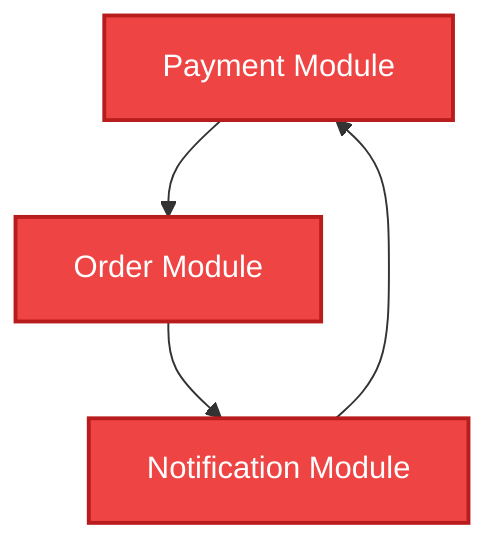

# Pertemuan 14: Penerapan Graf pada Sistem dan Jaringan Komputer

Selamat datang di Pertemuan 14! 🚀
Hari ini kita akan menjelajahi bagaimana teori graf menjadi pilar utama dalam membangun arsitektur fisik internet global dan sistem jaringan komputer. Tanpa pemahaman graf yang kuat, triliunan paket data yang kita kirimkan setiap hari—mulai dari chat WhatsApp, video streaming Netflix, hingga transaksi perbankan—akan tersesat di tengah jalan atau mengalami macet total di kabel bawah laut.

Kita akan membedah bagaimana berbagai **Topologi Jaringan** (Star, Ring, Mesh) dimodelkan sebagai graf, bagaimana router menentukan jalur pengiriman data menggunakan protokol **Routing IP**, dan bagaimana software engineer mencegah error fatal akibat **Circular Dependency** pada arsitektur sistem.

---

## 🎯 Tujuan Pembelajaran

Setelah menyelesaikan materi pada pertemuan ini, diharapkan kamu mampu:
1. **Menganalisis** kelebihan dan kekurangan berbagai topologi jaringan (Star, Ring, Mesh) menggunakan parameter teori graf (Vertex, Edge, Konektivitas) secara kritis.
2. **Menjelaskan** prinsip kerja protokol routing dinamis seperti OSPF (Open Shortest Path First) di dalam jaringan internet global.
3. **Menghitung** jumlah tautan kabel minimum yang dibutuhkan untuk membangun topologi jaringan tertentu secara matematis.
4. **Mendeteksi** dan mengatasi masalah ketergantungan melingkar (*circular dependency*) pada sistem perangkat lunak modern.

---

## 📚 1. Topologi Jaringan: Memodelkan Kabel Fisik sebagai Graf

Dalam jaringan komputer, cara kita menghubungkan perangkat-perangkat komputer (komputer, server, printer) menggunakan kabel fisik disebut **Topologi Jaringan**. Dalam kacamata matematika diskrit, topologi jaringan tidak lain adalah sebuah **Graf**.

### 💡 Ilustrasi Imajinatif
> **Refleksi:**
> * *Jika topologi-topologi jaringan ini dianalogikan sebagai cara orang berkomunikasi di dalam ruangan, seperti apa gambarannya?*

Mari kita analogikan tiga topologi utama:

#### 1. Topologi Star (Bintang) - Graf Bintang ⭐
Semua komputer dihubungkan ke satu perangkat pusat bernama Hub/Switch.
* **Analogi Komunikasi:** Seperti **rapat kelas yang dipimpin satu moderator utama** di tengah meja. Anggota rapat tidak boleh berbicara langsung satu sama lain; semua pesan harus melewati moderator. 
* **Analogi Graf:** Terdiri dari 1 simpul pusat dengan derajat tinggi, terhubung ke $n-1$ simpul daun.
* **Risiko:** Sangat murah dan mudah diatur. Namun, jika moderator pingsan (Switch pusat rusak), seluruh rapat langsung bubar total (*single point of failure*).

#### 2. Topologi Ring (Cincin) - Graf Lingkaran ⭕
Setiap komputer dihubungkan ke dua tetangga sebelahnya membentuk lingkaran tertutup.
* **Analogi Komunikasi:** Seperti **permainan telepon kaleng melingkar** dari anak ke anak. Pesan dikirim berputar searah jarum jam.
* **Analogi Graf:** Graf reguler di mana setiap simpul memiliki derajat tepat 2, membentuk siklus tunggal.
* **Risiko:** Hemat kabel. Namun, jika kabel satu anak saja putus, seluruh rantai komunikasi global langsung terhenti total.

#### 3. Topologi Mesh (Jala) - Graf Lengkap 🕸️
Setiap komputer memiliki kabel langsung ke semua komputer lainnya tanpa perantara.
* **Analogi Komunikasi:** Seperti **percakapan bebas di kedai kopi** di mana setiap orang bisa berbicara langsung ke siapa saja secara instan.
* **Analogi Graf:** Merupakan **Graf Lengkap $K_n$**.
* **Keunggulan:** Sangat andal! Jika satu orang pulang atau pingsan, komunikasi antar orang lainnya tetap berjalan mulus tanpa hambatan sedikit pun (*high fault tolerance*).
* **Kekurangan:** Sangat mahal dan rumit karena membutuhkan jumlah kabel yang luar biasa banyak ($\frac{n(n-1)}{2}$ kabel).

---

## 📚 2. Routing IP: Navigasi Triliunan Paket Data di Internet

Ketika kamu membuka video YouTube, file video tersebut dipecah menjadi miliaran paket data kecil. Paket-paket data ini harus menempuh perjalanan ribuan kilometer melewati puluhan perangkat **Router** fisik sebelum sampai ke layar HP-mu.

### 💡 Ilustrasi Imajinatif
> **Refleksi:**
> * *Jika internet adalah sistem pos raksasa, bagaimana surat dikirim antar kantor pos?*

Bayangkan setiap router di internet seperti **kantor pos cabang kecamatan**. 
Ketika sebuah paket surat (paket data) datang dengan alamat tujuan "Surabaya", petugas kantor pos (router) tidak langsung mengantarkannya sendiri ke Surabaya. Petugas membaca peta jaringan kantor pos (graf berbobot) dan menyerahkan surat itu ke kantor pos kecamatan tetangga terdekat yang berada di jalur tercepat menuju Surabaya. Jalur tercepat ini dihitung secara dinamis setiap detik menggunakan perhitungan matematika.

### 🔍 Protokol OSPF (Open Shortest Path First)
Dalam dunia jaringan, protokol standar yang digunakan oleh router Cisco atau Juniper adalah **OSPF**. Protokol ini bekerja dengan cara:
1. Setiap router menyebarkan informasi tentang siapa saja tetangganya langsung dan berapa latensi kabelnya.
2. Setiap router menyusun peta graf berbobot lengkap dari seluruh internet di dalam memorinya (*Link State Database*).
3. Setiap router secara mandiri menjalankan **Algoritma Dijkstra** untuk mencari rute tercepat dari dirinya sendiri ke semua subnet IP tujuan di dunia.
4. Hasil perhitungan dimasukkan ke dalam *Routing Table* sebagai kompas penunjuk arah pengiriman data tercepat.

---

## 🛠️ Studi Kasus Informatika: Deteksi Dependency System pada Package Manager & Clean Architecture

Dalam rekayasa perangkat lunak modern (*Software Engineering*), program besar dipecah menjadi puluhan modul kecil agar mudah dikelola. Namun, modul-modul ini sering saling mengimpor satu sama lain.

### Bahaya Circular Dependency:
Misalkan kamu sedang merancang arsitektur aplikasi e-commerce:
* Modul `Payment` membutuhkan modul `Order` untuk memverifikasi harga produk.
* Modul `Order` membutuhkan modul `Notification` untuk mengirim email sukses.
* Modul `Notification` membutuhkan modul `Payment` untuk menyertakan bukti transfer.

### Analisis Teori Graf:
Struktur impor di atas membentuk **Siklus Berarah** (loop) pada graf dependensi. Akibatnya:
1. **Memory Leak:** Saat aplikasi dijalankan, modul-modul ini akan saling memanggil tanpa henti di memori, menyebabkan RAM cepat penuh dan memicu crash.
2. **Compilation Error:** Compiler atau runner (seperti Node.js) akan bingung modul mana yang harus dimuat terlebih dahulu karena semuanya saling menunggu satu sama lain.

### Solusi Rekayasa (Dependency Inversion):
Untuk mengatasi masalah ini, kita menerapkan prinsip desain *Clean Architecture* dengan memotong rantai siklus. Kita membuat Interface atau Class perantara di tengah, sehingga graf berubah kembali menjadi asiklik (DAG - *Directed Acyclic Graph*), membebaskan aplikasi dari jebakan lingkaran setan memori.

---

## 📝 Latihan Soal & Asah Computational Thinking

### 🧠 Soal 1: Perhitungan Kabel Topologi Jaringan
Sebuah gedung perkantoran baru ingin menghubungkan **12 komputer staf**.
1. Jika kantor memilih menggunakan **Topologi Star**, berapakah jumlah kabel LAN minimum yang harus dibeli?
2. Jika kantor menginginkan keandalan 100% dan memilih membangun **Topologi Mesh** penuh, berapakah jumlah kabel LAN yang harus disediakan? Tunjukkan rumus dan langkah perhitunganmu!

### 📝 Soal 2: Analisis Keandalan Topologi Graf
Diberikan tiga diagram topologi jaringan komputer (Star, Ring, Mesh) dengan masing-masing memiliki 5 simpul.
Jelaskan secara matematis apa yang terjadi pada konektivitas jaringan (apakah jaringan terputus sebagian, terputus total, atau tetap terhubung sempurna) jika:
1. Pada **Topologi Star**, simpul pusat (*Switch*) mengalami mati daya.
2. Pada **Topologi Ring**, salah satu kabel di antara dua simpul putus digigit tikus.
3. Pada **Topologi Mesh**, dua kabel penghubung acak putus secara tidak sengaja.

### 💻 Soal 3: Audit Impor Modul Aplikasi Web
Kamu sedang memeriksa arsitektur kode dari aplikasi web portofoliomu. Terdapat modul-modul berikut beserta daftar impor dependensinya:
* Modul `Database.js` mengimpor `Config.js`
* Modul `Auth.js` mengimpor `Database.js`
* Modul `Config.js` mengimpor `Auth.js`

1. Gambarlah graf dependensi impor dari modul-modul di atas!
2. Apakah struktur kode di atas mengandung masalah *Circular Dependency*? Jelaskan bukti analisis grafmu!

---

## 📌 Kesimpulan

Teori graf adalah bahasa universal yang menyatukan dunia fisik (kabel, router) dengan dunia logis (modul software, alur data). Dengan memahami bagaimana merancang topologi jaringan yang andal, bagaimana router menghitung navigasi data lewat OSPF dan Dijkstra, serta bagaimana mendeteksi circular dependency pada arsitektur kode—kamu memiliki kualifikasi krusial untuk menjadi seorang Network Engineer ataupun Software Architect profesional.

> *"Internet global tidak dihubungkan oleh sihir, melainkan miliaran kabel fisik yang disatukan secara indah oleh hukum-hukum matematika Teori Graf."*

Sampai jumpa di **Pertemuan 15**, di mana kita akan merangkum seluruh perjalanan kita dan melihat penerapan Matematika Diskrit pada teknologi modern terpanas seperti Kecerdasan Buatan (AI) dan Cybersecurity! ⚡

---
*(buat pesan commit bahasa indonesia sederhana: "menambahkan materi kuliah pertemuan 14 tentang penerapan graf pada jaringan komputer")*
