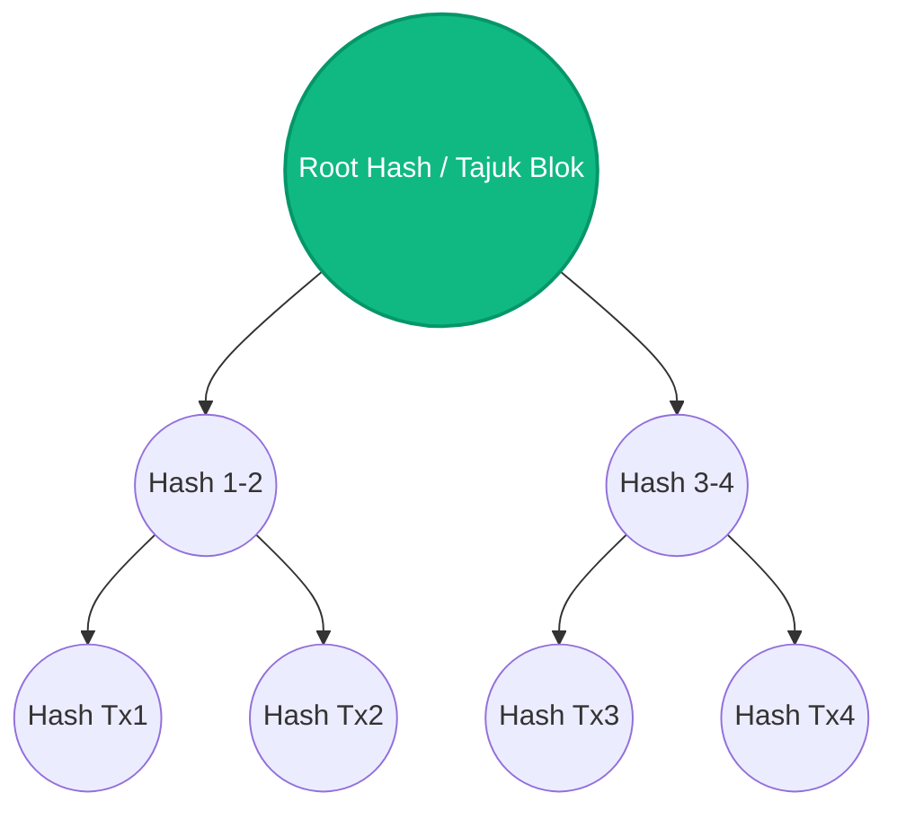

# Pertemuan 15: Penerapan Matematika Diskrit dalam Dunia Informatika Modern

Selamat datang di Pertemuan 15! 🚀
Kita telah sampai di puncak perjalanan materi perkuliahan kita. Selama satu semester ini, kita telah mempelajari logika, himpunan, relasi, kombinatorika, graf, hingga pohon. Mungkin di awal kamu sempat bertanya: *"Apakah semua matematika ini benar-benar terpakai di industri komputasi yang canggih?"*

Hari ini kita akan menjawabnya secara spektakuler! Kita akan melihat bagaimana seluruh konsep matematika diskrit yang terlihat sederhana di papan tulis bersatu padu untuk melahirkan teknologi paling revolusioner di abad ini: mulai dari kecerdasan buatan (**Artificial Intelligence - AI**), keamanan siber (**Cybersecurity**), teknologi mata uang digital (**Blockchain & Bitcoin**), hingga basis data berkinerja tinggi.

---

## 🎯 Tujuan Pembelajaran

Setelah menyelesaikan materi pada pertemuan ini, diharapkan kamu mampu:
1. **Mengaitkan** konsep teori graf dan pohon dengan struktur jaringan saraf tiruan (*Neural Networks*) pada bidang Kecerdasan Buatan (AI).
2. **Menjelaskan** penerapan teori bilangan bulat diskrit (aritmatika modular) pada algoritma enkripsi keamanan data perbankan (kriptografi).
3. **Menganalisis** pemanfaatan struktur pohon (*Merkle Tree*) dalam mengamankan transaksi desentralisasi pada teknologi Blockchain.
4. **Merefleksikan** pentingnya matematika diskrit sebagai bahan bakar utama dari seluruh inovasi rekayasa perangkat lunak modern.

---

## 💡 1. Ilustrasi Imajinatif: Orkestra Besar Komputasi Modern

> **Refleksi:**
> * *Jika seluruh cabang matematika diskrit adalah instrumen musik di dalam ruang konser orkestra besar, melodi apa yang mereka mainkan bersama untuk menciptakan aplikasi canggih?*

Bayangkan sebuah panggung **konser orkestra simfoni raksasa** yang sangat indah. Konser ini membawakan lagu berjudul *"Teknologi Informatika Modern"*:
* **Pemain Biola (Kriptografi / Keamanan Siber):** Memainkan melodi presisi yang sangat rumit menggunakan busur gesek **Teori Bilangan Bulat dan Aritmatika Modular**. Melodi ini menjaga agar tidak ada penonton ilegal yang bisa menyusup ke dalam gedung konser.
* **Pemain Terompet (Basis Data / SQL & NoSQL):** Mengumandangkan nada-nada tegas menggunakan harmonisasi **Teori Himpunan dan Relasi**. Nada-nada ini bertugas menata kursi penonton dengan sangat rapi dan mencarikan barang bawaan mereka yang hilang secara instan.
* **Pemain Drum (Kecerdasan Buatan / AI):** Menabuh ritme detak jantung yang dinamis menggunakan **Teori Graf Berarah Berbobot**. Detukan drum ini memberi tahu pahlawan utama (AI) ke mana ia harus melangkah mengejar melodi berikutnya.

Ketika konduktor mengangkat tongkatnya, seluruh instrumen matematika diskrit ini berbunyi bersama menghasilkan harmoni yang menakjubkan: sebuah aplikasi super canggih seperti ChatGPT, Mobile Legends, atau sistem pembayaran perbankan digital berjalan dengan sangat mulus di genggaman tanganmu.

---

## 📚 2. Menjelajahi Penerapan Nyata di Berbagai Bidang IT

Mari kita bedah bagaimana matematika diskrit bekerja "di bawah kap mesin" teknologi modern:

### 1. Kecerdasan Buatan (AI) & Neural Networks $\rightarrow$ Teori Graf Berbobot 🧠
Model pembelajaran mendalam (*Deep Learning*) yang digunakan untuk mendeteksi wajah atau memahami teks (seperti ChatGPT) dibangun di atas struktur **Jaringan Saraf Tiruan (Neural Network)**.
* **Representasi Matematika:** Neural Network tidak lain adalah sebuah **Graf Berarah Berbobot** raksasa.
* **Simpul (Vertex):** Mewakili neuron (titik pemroses informasi).
* **Sisi Berarah (Edge):** Mewakili sinapsis (koneksi transfer informasi).
* **Bobot (Weight):** Mewakili tingkat kepentingan informasi tersebut (*weights & biases*). Ketika AI "belajar", komputer sebenarnya sedang menjalankan algoritma optimasi graf untuk memperbarui miliaran angka bobot pada sisi-sisi graf tersebut agar prediksinya semakin akurat.

```
[ Input Neuron (V1) ] -----( Weight: 0.85 )-----> [ Hidden Neuron (V3) ]
[ Input Neuron (V2) ] -----( Weight: 0.12 )-----+
```

### 2. Cybersecurity & Kriptografi RSA $\rightarrow$ Aritmatika Modular 🔒
Bagaimana data kartu kreditmu aman saat berbelanja online? Kriptografi kunci publik (seperti algoritma RSA) menggunakan prinsip **Teori Bilangan Bulat**, khususnya **Aritmatika Modular** (sisa pembagian) dan faktor bilangan prima raksasa.
* **Cara Kerja:** Enkripsi pesan dilakukan menggunakan rumus modular:
  $$C \equiv M^e \pmod n$$
  Di mana $C$ adalah kode rahasia, $M$ adalah pesan asli, $e$ adalah kunci publik, dan $n$ adalah hasil kali dua bilangan prima raksasa. 
* Hacker tidak bisa memecahkan kode tersebut karena komputer modern membutuhkan waktu ribuan tahun untuk memfaktorkan angka $n$ raksasa kembali menjadi bilangan prima penyusunnya. Keamanan siber sepenuhnya dilindungi oleh kekerasan angka prima diskrit!

---

## 🛠️ Studi Kasus Informatika: Bagaimana Blockchain Mengamankan Data Keuangan dengan "Merkle Tree"

Teknologi **Blockchain** (yang melahirkan Bitcoin dan Ethereum) adalah sistem buku kas digital terdesentralisasi yang sangat aman dan mustahil untuk dipalsukan oleh peretas. Bagaimana cara Blockchain menjamin keamanan jutaan transaksi tersebut secara efisien? 

Blockchain menggunakan struktur pohon khusus yang disebut **Merkle Tree (Pohon Hash)**.



### Analisis Cara Kerja Merkle Tree:
1. Setiap transaksi keuangan individu (Tx1, Tx2, dst.) diubah menjadi kode enkripsi unik (Hash) menggunakan fungsi matematika diskrit satu arah (misalnya algoritma SHA-256).
2. Kode-kode hash transaksi ini dipasangkan dan digabungkan untuk di-hash kembali ke tingkat atas (menjadi `Hash 1-2` dan `Hash 3-4`).
3. Proses penggabungan berpasangan ini naik terus ke atas hingga menyisakan satu kode tunggal di puncak pohon yang disebut **Root Hash** (Akar Hash). Root Hash inilah yang disimpan di dalam kepala blok Blockchain.
4. **Keamanan Mutlak:** Jika seorang hacker mencoba mengubah satu karakter saja pada data transaksi Tx1 di tingkat paling bawah (daun), perubahan tersebut akan memicu efek domino yang secara otomatis mengubah nilai `Hash 1-2` dan akhirnya mengubah total nilai **Root Hash** di puncak pohon. Sistem Blockchain lain di dunia akan langsung mendeteksi ketidakcocokan Root Hash ini dan menolak transaksi palsu tersebut secara instan!

---

## 📝 Latihan Soal & Asah Computational Thinking

### 🧠 Soal 1: Pemodelan Neural Network sebagai Graf
Bayangkan sebuah Jaringan Saraf Tiruan sederhana yang terdiri dari:
* Lapis Input (*Input Layer*): Simpul $X_1$ dan $X_2$.
* Lapis Tersembunyi (*Hidden Layer*): Simpul $H_1$ dan $H_2$.
Semua simpul di Lapis Input terhubung langsung ke semua simpul di Lapis Tersembunyi dengan arah dari Input ke Hidden.
1. Gambarlah graf berarah yang merepresentasikan jaringan saraf ini!
2. Termasuk jenis graf apakah struktur koneksi di atas? (Petunjuk: Apakah ada sisi yang menghubungkan sesama simpul di satu lapisan yang sama?)

### 📝 Soal 2: Kriptografi Aritmatika Modular Sederhana (Caesar Cipher)
Salah satu kriptografi tertua adalah Caesar Cipher, yang menggeser huruf sejauh $k$ langkah di dalam alfabet (26 huruf). Secara matematis, rumus enkripsinya adalah:
$$E(x) = (x + k) \pmod{26}$$
Di mana huruf $A = 0, B = 1, C = 2, \dots, Z = 25$.

Jika kita menggunakan kunci geser $k = 3$:
1. Enkripsilah huruf **"N"** (Huruf ke-13, karena $A=0$, maka $N=13$) menggunakan rumus modular di atas! Tuliskan langkah perhitungannya dan huruf hasil enkripsinya!
2. Dekripsilah kembali hasil enkripsi tersebut untuk membuktikan kebenaran rumusnya!

### 💻 Soal 3: Studi Kasus Pembuatan Decision Tree (Pohon Keputusan) untuk Filter Spam Email
Kamu ditugaskan merancang aturan logika sederhana untuk memfilter email masuk apakah termasuk SPAM atau BUKAN SPAM. Kriteria yang kamu miliki adalah:
* Apakah email mengandung kata *"PROMO"*?
* Apakah pengirim email terdaftar di daftar kontak pengguna?
* Apakah email memiliki lampiran file mencurigakan (.exe)?

Gambarkan sebuah **Pohon Keputusan** (*Decision Tree*) terstruktur yang memadukan ketiga kriteria tersebut untuk menghasilkan kesimpulan akhir: **SPAM** atau **INBOX (BUKAN SPAM)**!

---

## 📌 Kesimpulan

Matematika Diskrit bukanlah lembaran teori usang yang terisolasi di dalam ruang kelas. Ia adalah bahasa pemrograman tingkat tinggi dari alam semesta digital kita. Mulai dari melatih miliaran neuron kecerdasan buatan, mengunci rahasia transaksi keuangan global lewat Blockchain, hingga mengamankan lalu lintas data perbankan dari serangan siber—semuanya ditenagai oleh keindahan logika diskrit. Menguasai matematika ini berarti kamu memegang kunci utama untuk menjadi pencipta inovasi teknologi di masa depan.

> *"Matematika Diskrit adalah semen yang menyatukan bata-bata silikon komputer, mengubah kode-kode biner mentah menjadi simfoni kecerdasan teknologi modern."*

Persiapkan dirimu dengan matang! Di pertemuan berikutnya, kita akan menempuh evaluasi akhir petualangan kita di **Pertemuan 16 (Ujian Akhir Semester)**! 🏁

---
*(buat pesan commit bahasa indonesia sederhana: "menambahkan materi kuliah pertemuan 15 tentang penerapan diskrit di teknologi modern")*
