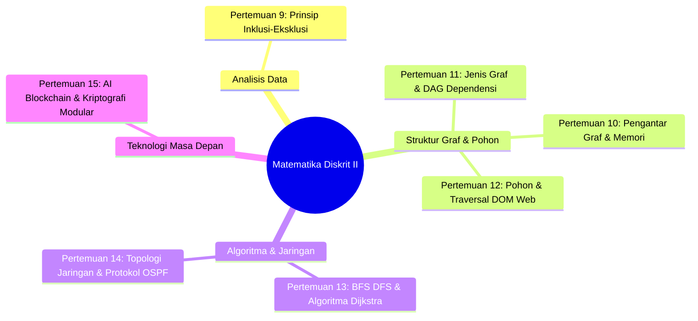

# Pertemuan 16: Ujian Akhir Semester (UAS) - Panduan & Simulasi Mandiri

Selamat! Kamu telah sampai di garis akhir petualangan luar biasa di dunia Matematika Diskrit. 🏁
Ujian Akhir Semester (UAS) adalah gerbang kelulusan yang menjadi bukti nyata dari metamorfosis pola pikirmu: dari seorang mahasiswa yang dulunya mungkin melihat matematika sebagai kumpulan rumus menakutkan, kini telah berubah menjadi seorang calon sarjana komputer yang andal, mampu memodelkan masalah kompleks secara logis, dan berpikir secara komputasional (*computational thinker*).

Dokumen final ini dirancang sebagai panduan persiapan belajar komprehensif, rangkuman materi dari Pertemuan 9 hingga 15, serta lembar simulasi soal ujian mandiri paruh kedua agar kamu benar-benar siap menaklukkan UAS dengan nilai terbaik!

---

## 🎯 Tujuan Evaluasi (Tujuan Pembelajaran)

Melalui Ujian Akhir Semester ini, diharapkan kamu mampu:
1. **Mengevaluasi** kasus perhitungan data majemuk tanpa duplikasi menggunakan Prinsip Inklusi-Eksklusi 2 dan 3 himpunan secara presisi.
2. **Memodelkan** struktur data non-linear (Graf dan Pohon) beserta representasi memorinya untuk memecahkan masalah sistem komputer.
3. **Menganalisis** rute terpendek dan efisiensi navigasi jaringan menggunakan algoritma graf (BFS, DFS, Dijkstra, OSPF) secara terstruktur.
4. **Menghubungkan** dasar teori matematika diskrit dengan pilar teknologi modern terpanas seperti Kecerdasan Buatan (AI), Kriptografi Keamanan, dan Blockchain.

---

## 📚 1. Peta Rangkuman Materi Paruh Kedua (Pertemuan 9 - 15)

Mari kita segarkan kembali ingatan kita tentang konsep-konsep hebat yang telah kita kuasai setelah UTS:



* **Pertemuan 9:** Logika pengurangan irisan tumpang tindih untuk menghindari hitung ganda (*double-counting*) lewat Prinsip Inklusi-Eksklusi pada data lintas perangkat.
* **Pertemuan 10:** Anatomi dasar Graf ($G=(V, E)$), derajat simpul, dan dua teknik penyimpanan memori utama: *Adjacency Matrix* (tabel cepat $O(1)$) dan *Adjacency List* (hemat ruang memori).
* **Pertemuan 11:** Graf Berarah (Instagram follow), Graf Berbobot (jarak jalan), Graf Lengkap ($K_n$), dan implementasi struktur *Directed Acyclic Graph* (DAG) untuk menyelesaikan urutan instalasi library package manager tanpa tabrakan dependensi.
* **Pertemuan 12:** Definisi Pohon (graf terhubung tanpa siklus), anatomi pohon (Root, Parent, Child, Leaf, Height), Pohon Biner, teknik penelusuran (Preorder, Inorder, Postorder), dan pemodelan DOM HTML oleh browser.
* **Pertemuan 13:** Algoritma navigasi graf: pencarian melebar lapis demi lapis BFS (menggunakan Queue), pencarian mendalam menyusuri cabang DFS (menggunakan Stack), dan pencari jalur tercepat Algoritma Dijkstra.
* **Pertemuan 14:** Penerapan graf pada kabel jaringan: Topologi Star (murah tapi rentan), Ring (hemat tapi rapuh), Mesh (sangat andal tapi mahal), serta protokol routing IP dinamis internet global (OSPF).
* **Pertemuan 15:** Mahakarya aplikasi diskrit: representasi AI Neural Network sebagai graf berbobot, pengamanan data bank lewat kriptografi modular RSA, dan rantai hash transaksi Blockchain menggunakan *Merkle Tree*.

---

## 💡 2. Ilustrasi Imajinatif: Ujian Akhir sebagai "The Grand Graduation Quest"

> **Refleksi:**
> * *Jika UAS adalah babak terakhir di dalam game petualangan, apa yang sedang dihadapi oleh pahlawanmu?*
> * *Bagaimana perasaanmu setelah mengumpulkan seluruh lencana kekuatan?*

Bayangkan UAS ini seperti **The Grand Graduation Quest (Misi Kelulusan Agung)** pada tingkat terakhir game petualanganmu:
* **Arena Ujian (The Final Dungeon):** Adalah sebuah kastil megah yang dipenuhi teka-teki labirin graf dan enkripsi pintu rahasia modular.
* **Lencana Kekuatan (Materi Kuliah):** Kamu tidak masuk ke kastil ini dengan tangan kosong. Kamu telah mengumpulkan Lencana Graf dari Pertemuan 10, Lencana Dijkstra dari Pertemuan 13, dan Lencana Blockchain dari Pertemuan 15. Semua lencana ini bersinar di sabuk senjatamu.
* **Kemenangan Sejati:** Ketika kamu dihadapkan pada gerbang rahasia terkunci (Soal Ujian), kamu tidak lagi panik. Kamu tersenyum tenang, mengeluarkan kunci algoritma yang tepat dari tasmu, dan memecahkan kodenya dengan ketukan logika yang mantap. 

Setelah gerbang terbuka, kamu keluar sebagai pemenang sejati: siap diwisuda dan melangkah ke dunia industri teknologi nyata sebagai seorang Insinyur Komputer yang gagah berani!

---

## 🔍 3. Contoh Sederhana: Tips Cepat Menghafal Aturan Traversal Pohon Biner

Saat ujian, mudah sekali tertukar dalam menuliskan hasil penelusuran pohon biner. Gunakan tips **Jembatan Keledai Posisi ROOT** berikut agar tidak pernah lupa selamanya:

* **PRE-order (ROOT di DEPAN):**
  * Urutan: **Root** $\rightarrow$ Kiri $\rightarrow$ Kanan.
  * *Ingat:* Kata "PRE" artinya sebelum / di depan. Jadi, kunjungi **Root** terlebih dahulu sebelum melangkah ke anak-anaknya.
* **IN-order (ROOT di TENGAH):**
  * Urutan: Kiri $\rightarrow$ **Root** $\rightarrow$ Kanan.
  * *Ingat:* Kata "IN" artinya di dalam / di antara. Jadi, kunjungi **Root** tepat di tengah-tengah antara anak kiri dan anak kanan.
* **POST-order (ROOT di BELAKANG):**
  * Urutan: Kiri $\rightarrow$ Kanan $\rightarrow$ **Root**.
  * *Ingat:* Kata "POST" artinya setelah / di belakang (seperti pasca-bayar). Jadi, selamatkan anak-anaknya terlebih dahulu di bawah, baru kunjungi **Root** paling akhir di belakang.

---

## 🛠️ 4. Studi Kasus Informatika: Audit Forensik Keamanan Jaringan Transaksi Finansial

Sebuah bank digital mengalami kegagalan pengiriman data transaksi antar kantor cabang regional. Sebagai Head of Security & Networks, kamu melakukan audit forensik terhadap topologi jaringan penghubung yang dimodelkan sebagai graf berbobot (bobot = latensi koneksi dalam ms).

```
       [ Cabang B ] ------( 5 ms )------ [ Cabang D ]
      /  |                                |  \
 (4 ms) (2 ms)                         (3 ms) (6 ms)
    /    |                                |    \
 [ Pusat A ]                              |   [ Cabang Z ]
    \    |                                |    /
 (8 ms)  |                                |  (2 ms)
      \  |                                |  /
       [ Cabang C ] ------( 10 ms )------ [ Cabang E ]
```

### Hasil Temuan Audit Logika:
1. **Insiden Kabel Putus:** Kabel utama penghubung langsung antara `Cabang B` dan `Cabang D` putus total akibat galian konstruksi jalan raya.
2. **Kondisi Awal Jalur Dijkstra Tercepat dari A ke Z:** 
   * Sebelum putus: **A $\rightarrow$ B $\rightarrow$ D $\rightarrow$ Z** dengan total latensi = $4 + 5 + 6 = \mathbf{15\text{ ms}}$.
3. **Rute Alternatif Tercepat Pasca-Insiden (Dihitung Ulang Secara Dinamis oleh Protokol OSPF):**
   * Karena jalur B-D terputus (bobot menjadi $\infty$), router secara otomatis menghitung ulang jalur terpendek baru lewat Dijkstra.
   * Rute alternatif baru: **A $\rightarrow$ B $\rightarrow$ C $\rightarrow$ E $\rightarrow$ Z** dengan total latensi = $4 + 2 + 10 + 2 = \mathbf{18\text{ ms}}$.
   * *Kesimpulan Audit:* Berkat penggunaan protokol routing dinamis berbasis graf (OSPF), meskipun terjadi kecelakaan fisik kabel putus, koneksi transaksi perbankan digital **tetap berjalan mulus** (hanya mengalami sedikit kenaikan latensi sebesar 3 ms) tanpa memicu pemadaman layanan perbankan (*high availability*).

---

## 📝 5. Lembar Simulasi Mandiri Soal UAS Matematika Diskrit

Sediakan lembar jawaban kosong. Kerjakan simulasi ujian akhir ini dalam waktu **120 menit** dengan jujur secara mandiri!

### BAGIAN A: SOAL PILIHAN GANDA (Bobot: 30%)
1. Di sebuah survei terhadap 100 user, 60 menyukai fitur dark-mode, 50 menyukai fitur voice-command, dan 20 menyukai kedua-duanya. Berapakah jumlah user yang tidak menyukai fitur dark-mode maupun voice-command?
   * a. 10 user
   * b. 20 user
   * c. 30 user
   * d. 110 user

2. Manakah di antara pernyataan berikut yang benar mengenai *Adjacency Matrix*?
   * a. Sangat hemat memori untuk graf dengan sedikit koneksi (*sparse graph*).
   * b. Membutuhkan waktu $O(N)$ untuk memeriksa apakah dua simpul bertetangga langsung.
   * c. Menggunakan tabel array 2 dimensi berukuran $N \times N$.
   * d. Tidak bisa digunakan untuk memodelkan graf berbobot.

3. Sebuah graf berarah tanpa memiliki siklus melingkar sama sekali di dalam ilmu komputer dinamakan...
   * a. Complete Graph
   * b. Directed Acyclic Graph (DAG)
   * c. Weighted Clique
   * d. Binary Search Tree

4. Pada penelusuran pohon biner, jika kita mengunjungi subpohon kiri terlebih dahulu, dilanjutkan dengan mengunjungi Root, baru kemudian mengunjungi subpohon kanan, maka kita menggunakan metode traversal...
   * a. Preorder
   * b. Inorder
   * c. Postorder
   * d. Level-order

5. Struktur data pohon (*tree*) khusus yang digunakan pada teknologi Blockchain untuk mengamankan integritas jutaan data transaksi secara terdesentralisasi adalah...
   * a. Red-Black Tree
   * b. Expression Tree
   * c. Merkle Tree
   * d. Decision Tree

---

### BAGIAN B: SOAL ESSAY & ANALISIS KOMPUTASIONAL (Bobot: 70%)

#### Soal 1: Analisis Inklusi-Eksklusi 3 Himpunan (Bobot: 20%)
Dashboard analitik web mencatat data unik pengguna yang berkunjung ke platform e-commerce melalui 3 perangkat: **Mobile App ($M$)**, **Desktop Browser ($D$)**, dan **Smart TV App ($T$)**.
* $|M| = 80.000$ user
* $|D| = 50.000$ user
* $|T| = 15.000$ user
* $|M \cap D| = 12.000$ user
* $|M \cap T| = 4.000$ user
* $|D \cap T| = 3.000$ user
* $|M \cap D \cap T| = 2.000$ user (mengakses lewat ketiga perangkat sekaligus)

Hitunglah total **Pengunjung Unik Nyata (Riil)** yang berkunjung ke platform e-commerce tersebut menggunakan rumus Prinsip Inklusi-Eksklusi 3 Himpunan secara terstruktur!

#### Soal 2: Navigasi Rute Terpendek Dijkstra (Bobot: 25%)
Diberikan graf berbobot (bobot = jarak dalam km) berikut:
* Simpul: $A, B, C, D, E, Z$
* Sisi berbobot:
  * $A \rightarrow B = 3$, $A \rightarrow C = 5$
  * $B \rightarrow C = 1$, $B \rightarrow D = 6$
  * $C \rightarrow D = 2$, $C \rightarrow E = 7$
  * $D \rightarrow E = 1$, $D \rightarrow Z = 8$
  * $E \rightarrow Z = 3$

Kamu diminta mencari jalur pengiriman paket logistik terdekat dari **Gudang A** ke **Toko Z**.
1. Susunlah **Tabel Penelusuran Jalur Dijkstra** langkah demi langkah secara rapi dan presisi seperti yang dipelajari pada Pertemuan 13!
2. Tuliskan rute lintasan terpendek akhir yang didapatkan beserta total jarak minimalnya!

#### Soal 3: Pohon Biner & Penelusurannya (Bobot: 25%)
Perhatikan gambar diagram pohon biner berikut:

```
            [ R ]
           /     \
        [ S ]   [ T ]
       /     \     \
    [ U ]   [ V ] [ W ]
```

1. Tuliskan simpul manakah yang bertindak sebagai:
   * a. **Root**
   * b. **Leaf** (semua daun)
   * c. **Internal Nodes** (simpul selain root dan daun)
2. Tuliskan hasil penelusuran simpul secara urut menggunakan metode:
   * a. **Preorder Traversal**
   * b. **Inorder Traversal**
   * c. **Postorder Traversal**

---

## 📌 Kesimpulan & Salam Perpisahan

Selamat! Kamu telah menyelesaikan seluruh modul pembelajaran Matematika Diskrit untuk mahasiswa Informatika. 

Ingatlah selalu: ilmu yang kamu pelajari di sini bukan sekadar coretan kapur untuk lulus ujian. Pola pikir logis, kemampuan mendeteksi bug secara sistematis, keahlian memodelkan struktur data efisien lewat graf dan pohon, serta pemahaman keamanan siber lewat modular—semuanya adalah **senjata rahasia utama** yang akan membedakanmu dengan programmer biasa di dunia kerja nanti.

> *"Komputer mungkin dibuat dari materi fisik seperti silikon dan kabel tembaga, namun jiwanya sepenuhnya ditenagai oleh Matematika Diskrit dan Logika. Selamat berjuang di UAS, masa depan dunia teknologi ada di tangan logikamu!"*

Sampai jumpa di wisuda kelulusanmu kelak! Sukses selalu untuk perjalanan akademik dan karirmu di dunia Informatika! 🎓🌟

---
*(buat pesan commit bahasa indonesia sederhana: "menambahkan materi kuliah pertemuan 16 tentang panduan dan simulasi uas")*
