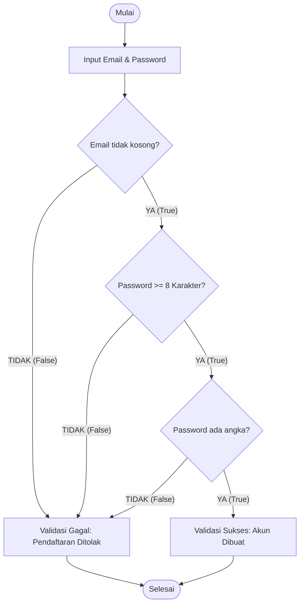

# Pertemuan 2: Logika Proposisional dan Tabel Kebenaran

Selamat datang kembali di petualangan Matematika Diskrit! ⚡ 
Setelah di pertemuan pertama kita mengenal apa itu dunia diskrit dan mengapa komputer membutuhkannya, sekarang saatnya kita masuk ke gerbang pertama logika: **Logika Proposisional**. 

Jika di dunia pemrograman kamu sering menggunakan pernyataan `if (kondisi)`, maka logika proposisional adalah sains di balik bagaimana kondisi tersebut dievaluasi. Di pertemuan ini, kita akan belajar bagaimana menyusun pernyataan logis, menggabungkannya dengan operator, dan mengujinya menggunakan alat sakti bernama **Tabel Kebenaran**.

---

## 🎯 Tujuan Pembelajaran

Setelah menyelesaikan materi pada pertemuan ini, diharapkan kamu mampu:
1. **Mengidentifikasi** pernyataan proposisi dan menentukan nilai kebenarannya (*True* atau *False*) dengan tepat.
2. **Menerapkan** berbagai operator logika dasar (AND, OR, NOT, XOR, Implikasi, Biimplikasi) dalam menghubungkan proposisi.
3. **Menyusun** tabel kebenaran untuk ekspresi logika majemuk dengan benar secara mandiri.
4. **Menganalisis** kebenaran logika pada kondisi percabangan pemrograman melalui studi kasus *Form Validation*.

---

## 📚 1. Proposisi: Pijakan Logika yang Pasti

Sebelum kita mulai merangkai logika yang rumit, kita harus memiliki bahan dasarnya terlebih dahulu. Bahan dasar itu bernama **Proposisi**.

### 💡 Ilustrasi Imajinatif
> **Refleksi:**
> * *Jika proposisi adalah sebuah benda di dunia nyata, ia akan seperti apa?*
> * *Bagaimana membedakan proposisi dengan kalimat biasa kepada seseorang yang belum pernah belajar logika?*

Bayangkan proposisi seperti sebuah **kunci pintu elektronik**. Kunci ini hanya memiliki dua status fisik yang mutlak: **terkunci rapat (FALSE)** atau **terbuka lebar (TRUE)**. Tidak ada kondisi di mana pintu tersebut "setengah terkunci" atau "agak terbuka". 

Setiap kali kita mengucapkan sebuah kalimat proposisi, kita sedang mencoba memasukkan kunci tersebut ke dalam pembaca kartu: hasilnya harus menghasilkan sinyal hijau (Benar) atau merah (Salah). Kalimat yang tidak bisa dinilai benar atau salahnya adalah kunci rusak yang tidak bisa dimasukkan ke dalam sistem.

### 🔍 Penjelasan Konsep
Secara formal, **Proposisi** adalah sebuah kalimat deklaratif (pernyataan) yang memiliki tepat satu nilai kebenaran, yaitu **Benar (True/T/1)** saja, atau **Salah (False/F/0)** saja, tetapi tidak keduanya sekaligus.

Mari kita lihat beberapa contoh untuk memperjelas perbedaannya:

| Kalimat | Apakah Proposisi? | Nilai Kebenaran | Alasan |
| :--- | :---: | :---: | :--- |
| "Jakarta adalah ibu kota Indonesia." | **YA** | *True* (Benar) | Pernyataan fakta yang benar. |
| "Angka 8 adalah bilangan ganjil." | **YA** | *False* (Salah) | Pernyataan matematika yang salah. |
| "Tolong buka pintu itu!" | **TIDAK** | - | Kalimat perintah, tidak bernilai benar/salah. |
| "Apakah kamu sudah makan?" | **TIDAK** | - | Kalimat tanya, tidak memiliki nilai kebenaran. |
| "$x + 5 = 12$" | **TIDAK** | - | Nilainya tidak pasti sebelum nilai $x$ ditentukan. |

Proposisi biasanya dilambangkan dengan huruf kecil seperti $p$, $q$, $r$, dan $s$. 
Contoh:
* $p$ : "Server basis data sedang aktif."
* $q$ : "Jaringan internet mengalami gangguan."

---

## 📚 2. Operator Logika: Gerbang Penghubung Pikiran

Di dunia nyata, kita jarang sekali menggunakan pernyataan tunggal. Kita sering menggabungkan beberapa pernyataan menggunakan kata hubung seperti *"dan"*, *"atau"*, atau *"jika... maka..."*. Di dalam Matematika Diskrit, kata hubung ini disebut **Operator Logika**.

### 💡 Ilustrasi Imajinatif
> **Refleksi:**
> * *Jika operator logika adalah sirkuit listrik, bagaimana cara menggambarkannya secara visual?*

Bayangkan kita memiliki sebuah lampu bohlam yang dihubungkan ke sumber listrik melalui dua saklar fisik, yaitu saklar $p$ dan saklar $q$:

1. **Operator AND (Konjungsi - $\land$):** Bayangkan dua saklar dipasang secara **Seri** (berurutan satu jalur). Arus listrik hanya akan mengalir dan menyalakan lampu jika Saklar $p$ **DAN** Saklar $q$ sama-sama ditutup (ON). Jika salah satu saja terbuka (OFF), lampu mati.
2. **Operator OR (Disjungsi - $\lor$):** Bayangkan dua saklar dipasang secara **Paralel** (berdampingan jalur). Arus listrik bisa mengalir melewati jalur atas atau jalur bawah. Lampu akan menyala jika Saklar $p$ **ATAU** Saklar $q$ ditutup (ON). Lampu hanya mati jika kedua saklar terbuka.
3. **Operator NOT (Negasi - $\neg$ atau $\sim$):** Ini adalah **Saklar Inverter**. Ketika kamu tidak menekannya (OFF), arus justru mengalir (lampu menyala). Ketika kamu menekannya (ON), arus justru terputus (lampu mati). Ia bekerja membalikkan keadaan.

```
AND (Seri):      [Listrik] ----[ Saklar p ]----[ Saklar q ]---- ( Lampu )
OR (Paralel):                 +---[ Saklar p ]---+
                 [Listrik] ---+                  +------------- ( Lampu )
                              +---[ Saklar q ]---+
```

### 🔍 Mengenal 6 Operator Logika Utama

Berikut adalah ringkasan dari 6 operator logika yang wajib kamu kuasai sebagai calon programmer:

| Nama Operator | Simbol | Arti | Karakteristik Utama |
| :--- | :---: | :--- | :--- |
| **Negasi (NOT)** | $\neg$ atau $\sim$ | Tidak / Bukan | Membalikkan nilai (*True* jadi *False*, dan sebaliknya). |
| **Konjungsi (AND)** | $\land$ | Dan | Hanya bernilai **True** jika **KEDUA** proposisi bernilai *True*. |
| **Disjungsi (OR)** | $\lor$ | Atau | Bernilai **True** jika **SALAH SATU atau KEDUA** proposisi bernilai *True*. |
| **Exclusive OR (XOR)**| $\oplus$ | Pilihan Eksklusif | Hanya bernilai **True** jika **SALAH SATU** bernilai *True* (tidak boleh keduanya). |
| **Implikasi** | $\rightarrow$ | Jika... Maka... | Hanya bernilai **False** jika janji diingkari (Sebab *True*, Akibat *False*). |
| **Biimplikasi** | $\leftrightarrow$ | Jika dan Hanya Jika| Bernilai **True** jika **KEDUA** proposisi memiliki nilai yang **SAMA**. |

---

## 📚 3. Tabel Kebenaran: Laboratorium Evaluasi Logika

Bagaimana kita bisa membuktikan nilai kebenaran dari ekspresi logika majemuk yang sangat panjang seperti $\neg(p \land q) \lor r$? Jawabannya adalah dengan membuat **Tabel Kebenaran** (*Truth Table*).

Tabel kebenaran adalah tabel matematika yang memuat seluruh kemungkinan kombinasi nilai kebenaran dari proposisi-proposisi tunggalnya. Jika ada $n$ buah proposisi tunggal, maka jumlah baris kombinasi pada tabel adalah $2^n$ baris.
* Untuk 2 proposisi ($p$ dan $q$), maka ada $2^2 = 4$ baris.
* Untuk 3 proposisi ($p$, $q$, dan $r$), maka ada $2^3 = 8$ baris.

### 📝 Contoh Pembuatan Tabel Kebenaran Dasar
Mari kita buat tabel kebenaran untuk operator-operator dasar:

| $p$ | $q$ | $\neg p$ | $p \land q$ | $p \lor q$ | $p \oplus q$ | $p \rightarrow q$ | $p \leftrightarrow q$ |
| :---: | :---: | :---: | :---: | :---: | :---: | :---: | :---: |
| **T** | **T** | F | **T** | T | F | **T** | T |
| **T** | **F** | F | F | T | **T** | **F** | F |
| **F** | **T** | T | F | T | **T** | **T** | F |
| **F** | **F** | T | F | F | F | **T** | T |

> **⚠️ Catatan Penting Implikasi ($p \rightarrow q$):**
> Perhatikan baris ketiga: **Sebab Salah ($F$) $\rightarrow$ Akibat Benar ($T$) menghasilkan nilai TRUE ($T$).** 
> *Kenapa?* Bayangkan dosenmu berkata: *"Jika kamu dapat nilai A ($p$), maka saya beri kamu hadiah ($q$)"*. 
> Jika kamu *tidak* mendapat nilai A ($F$), dosenmu bebas memberi hadiah atau tidak ($T$ atau $F$). Dosenmu tidak bersalah (tidak bohong), sehingga pernyataan implikasi tersebut secara logis tetap dinilai **Benar (True)**. Satu-satunya kondisi dosenmu berbohong (False) adalah jika kamu mendapat nilai A ($T$) tetapi dia *tidak* memberimu hadiah ($F$).

---

## 🛠️ Studi Kasus Informatika: Validasi Formulir Pendaftaran Akun

Saat kamu membuat fitur pendaftaran pengguna (Sign Up) di sebuah situs web, kamu harus memastikan input yang dimasukkan pengguna valid dan aman. Mari kita buat aturan logikanya!

### Skenario Kasus:
Sebuah akun baru dinyatakan valid (`isValid == TRUE`) jika dan hanya jika:
1. Kolom Email tidak kosong (`emailNotEmpty == TRUE`), **DAN**
2. Password memiliki minimal 8 karakter (`passwordLengthOK == TRUE`), **DAN**
3. Password harus mengandung setidaknya satu angka (`passwordHasNumber == TRUE`).

### Flowchart Validasi Logika:



### Implementasi Ekspresi Logika Pemrograman:
Jika kita tuliskan dalam variabel boolean, rumusnya adalah:
$$\text{isValid} = \text{emailNotEmpty} \land \text{passwordLengthOK} \land \text{passwordHasNumber}$$

Mari kita uji dengan beberapa input dari pengguna:

* **Pengguna 1:** Input Email: `nasir@mail.com`, Password: `rahasia` (panjang 7, tidak ada angka)
  * $\text{emailNotEmpty} = T$
  * $\text{passwordLengthOK} = F$
  * $\text{passwordHasNumber} = F$
  * Evaluasi: $\text{isValid} = T \land F \land F \rightarrow \textbf{FALSE}$ (Ditolak! ❌)

* **Pengguna 2:** Input Email: `admin@mail.com`, Password: `rahasia123` (panjang 10, ada angka)
  * $\text{emailNotEmpty} = T$
  * $\text{passwordLengthOK} = T$
  * $\text{passwordHasNumber} = T$
  * Evaluasi: $\text{isValid} = T \land T \land T \rightarrow \textbf{TRUE}$ (Diterima!  )

Pemahaman logika ini membantu kita menulis kode pemrograman terstruktur yang mencegah celah keamanan pada aplikasi.

---

## 📝 Latihan Soal & Asah Computational Thinking

Asah kemampuan logikamu dengan menjawab tantangan di bawah ini!

### 🧠 Soal 1: Klasifikasi Proposisi
Tentukan apakah kalimat-kalimat berikut merupakan **Proposisi** atau **Bukan Proposisi**, beserta nilai kebenarannya jika ada!
1. "Jumlah sudut dalam suatu segitiga adalah $180^\circ$."
2. "Jangan menaruh laptop di atas kasur!"
3. "Bahasa Python lebih mudah dipelajari daripada bahasa C++." (Hati-hati dengan kalimat opini!)
4. "$2x + 10 = 20$."

### 📝 Soal 2: Menyusun Tabel Kebenaran Majemuk
Buatlah tabel kebenaran secara lengkap untuk ekspresi logika berikut:
$$\text{Hasil} = (p \lor q) \land \neg(p \land q)$$
*Petunjuk: Identifikasi operator mana saja yang harus diselesaikan terlebih dahulu di kolom pembantu!*

### 💻 Soal 3: Studi Kasus Gerbang Logika IoT
Sebuah **Smart Home** memiliki sistem alarm otomatis. Alarm akan berbunyi (`Alarm = True`) jika:
* Sensor Gerak mendeteksi aktivitas di luar rumah (`SensorGerak = True`) **DAN** Hari sudah malam (`IsMalam = True`).
* **ATAU**, jika Pemilik Rumah menekan Tombol Panik manual (`PanicButton = True`).

1. Tuliskan ekspresi logika boolean untuk variabel `Alarm`!
2. Buatlah tabel kebenaran untuk sistem alarm ini (ada 3 proposisi input: `SensorGerak`, `IsMalam`, `PanicButton`)!

---

## 📌 Kesimpulan

Logika Proposisional adalah fondasi berpikir komputer paling mendasar. Komputer tidak pernah menebak-nebak; semua dievaluasi secara biner antara benar (*True*) atau salah (*False*). Dengan memahami bagaimana operator logika bekerja dan cara menyusun tabel kebenaran, kamu sudah memiliki modal utama untuk menulis program komputer yang terstruktur, efisien, dan bebas dari *logical bug*.

> *"Di dalam komputer, kebenaran bukanlah sebuah spekulasi, melainkan hasil perhitungan matematis yang pasti."*

Sampai jumpa di **Pertemuan 3**, di mana kita akan memperluas cakrawala logika kita dengan mempelajari kuantitas objek lewat **Logika Predikat**! 🚀

---
*(buat pesan commit bahasa indonesia sederhana: "menambahkan materi kuliah pertemuan 2 tentang logika proposisional")*
