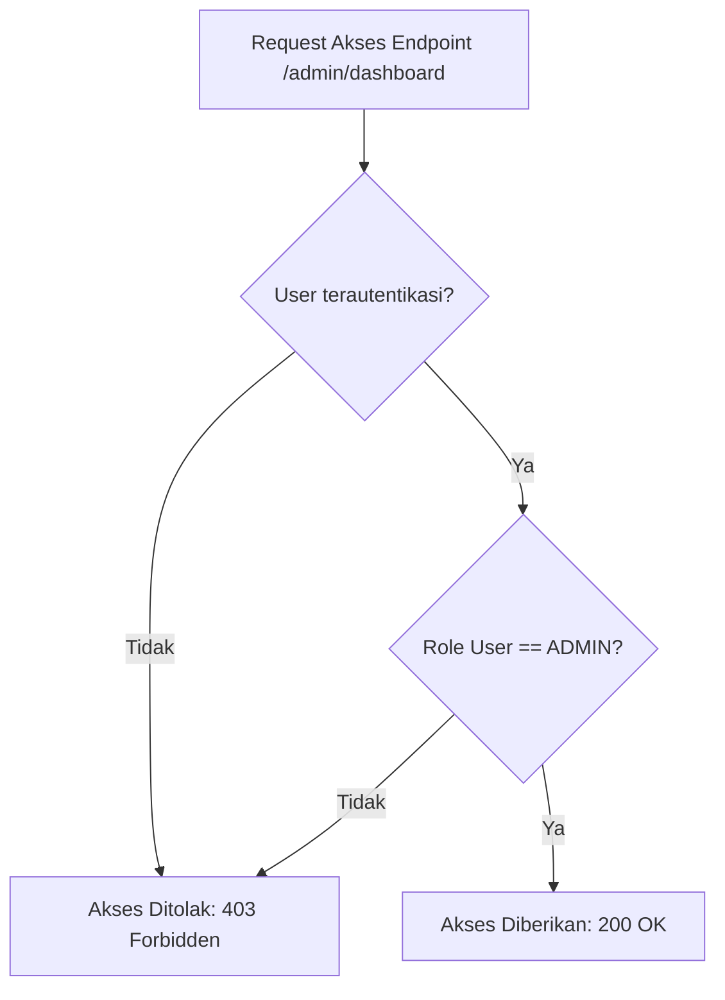

# Pertemuan 3: Logika Predikat dan Penalaran Matematis

Selamat datang di Pertemuan 3! 🚀 
Pada pertemuan sebelumnya, kita telah menguasai Logika Proposisional. Namun, logika proposisional memiliki keterbatasan: ia hanya mampu mengevaluasi kalimat secara utuh tanpa bisa melihat detail objek di dalamnya. 

Di pertemuan ini, kita akan mempelajari **Logika Predikat**, sebuah sistem logika yang lebih cerdas yang mampu menganalisis kuantitas objek menggunakan **Kuantor** (Universal dan Eksistensial). Selain itu, kita juga akan belajar bagaimana berpikir layaknya seorang detektif komputer dalam menarik kesimpulan yang sah lewat **Penalaran Matematis**.

---

## 🎯 Tujuan Pembelajaran

Setelah menyelesaikan materi pada pertemuan ini, diharapkan kamu mampu:
1. **Membedakan** antara proposisi tunggal dengan kalimat terbuka (predikat) secara jelas.
2. **Menerapkan** Kuantor Universal ($\forall$) dan Kuantor Eksistensial ($\exists$) dalam merepresentasikan pernyataan logika matematika.
3. **Menganalisis** keabsahan argumen menggunakan hukum-hukum penarikan kesimpulan (Modus Ponens, Modus Tollens, dan Silogisme).
4. **Menerapkan** logika predikat untuk merancang aturan otorisasi akses (*Authorization & Role-Based Access Control*) pada sistem basis data.

---

## 📚 1. Logika Predikat: Membedah Kalimat Lebih Dalam

Jika logika proposisional menganggap kalimat *"Nasir adalah programmer"* sebagai variabel tunggal $p$, maka logika predikat memecah kalimat tersebut menjadi dua bagian: subjek (Nasir) dan predikat (adalah programmer).

### 💡 Ilustrasi Imajinatif
> **Refleksi:**
> * *Jika predikat adalah sebuah cetakan kue dan subjek adalah adonannya, bagaimana mereka bekerja bersama?*

Bayangkan predikat seperti sebuah **fungsi dalam bahasa pemrograman** (Method/Function). 
Misalkan kita membuat sebuah fungsi bernama `isProgrammer(x)`:
```javascript
function isProgrammer(nama) {
    // Fungsi ini akan mengecek apakah 'nama' berprofesi sebagai programmer
    if (nama === "Nasir") return true;
    else return false;
}
```
Ketika fungsi ini berdiri sendiri sebagai `isProgrammer(x)`, kita belum bisa menentukan nilai kebenarannya karena variabel $x$ (argumen fungsi) masih kosong. Ini disebut **Kalimat Terbuka**.
Namun, begitu kita memasukkan nilai ke dalam parameter tersebut—misalnya `isProgrammer("Nasir")`—maka fungsi akan mengembalikan nilai `TRUE`. Kalimat tersebut kini telah berubah menjadi **Proposisi**.

### 🔍 Penjelasan Konsep
Secara formal, **Predikat** adalah pernyataan yang melibatkan variabel yang nilainya belum ditentukan. Predikat dilambangkan dengan huruf kapital seperti $P(x)$, $Q(x, y)$, di mana $P$ adalah predikat, dan $x$ serta $y$ adalah variabel.

Contoh:
* $P(x)$ : "$x$ adalah sistem operasi berbasis Linux."
  * Jika $x$ diganti "Ubuntu", maka $P(\text{"Ubuntu"})$ bernilai **True**.
  * Jika $x$ diganti "Windows 11", maka $P(\text{"Windows 11"})$ bernilai **False**.
* $Q(x, y)$ : "$x$ lebih besar dari $y$."
  * Jika $x = 8, y = 3$, maka $Q(8, 3)$ bernilai **True**.

---

## 📚 2. Kuantor: Mengukur Kuantitas Semesta

Dalam pemrograman, kita sering kali harus menguji seluruh data di dalam array atau mencari apakah ada minimal satu data yang memenuhi syarat. Di sinilah **Kuantor** berperan. Kuantor menyatakan lingkup (kuantitas) variabel dalam suatu predikat.

### 💡 Ilustrasi Imajinatif
> **Refleksi:**
> * *Bagaimana cara menganalogikan kuantor universal dan eksistensial menggunakan aktivitas sehari-hari seorang administrator jaringan?*

Bayangkan seorang SysAdmin yang sedang mengelola laboratorium komputer kampus:
1. **Kuantor Universal ($\forall$ - dibaca "Untuk Semua / Setiap"):**
   SysAdmin berkata: *"Semua komputer di lab harus terinstal sistem operasi Ubuntu."* 🖥️
   Pernyataan ini bernilai **Benar** jika dan hanya jika ia mengecek komputer ke-1, ke-2, ke-3, hingga komputer terakhir, dan *semuanya* terpasang Ubuntu. Jika ada **satu saja** komputer yang terpasang Windows, maka pernyataan SysAdmin tersebut langsung menjadi **Salah**. Komputer Windows tersebut dinamakan **Counterexample** (Contoh Penyangkal).
2. **Kuantor Eksistensial ($\exists$ - dibaca "Ada / Terdapat setidaknya satu"):**
   SysAdmin berkata: *"Ada komputer di lab ini yang terinfeksi malware."* 🦠
   Pernyataan ini bernilai **Benar** jika SysAdmin berhasil menemukan **minimal satu** komputer yang terinfeksi malware. Ia tidak perlu membuktikan bahwa semua komputer terkena virus; cukup satu bukti saja sudah membuat kalimatnya menjadi **Benar**. Kalimat ini baru dinilai **Salah** jika ia memeriksa *seluruh* komputer dan ternyata bersih tanpa terkecuali.

| Jenis Kuantor | Simbol | Arti | Analog Pemrograman | Contoh Matematika |
| :--- | :---: | :--- | :--- | :--- |
| **Universal** | $\forall$ | "Untuk semua $x$..." | Metode `array.every()` | $\forall x \in \mathbb{R}, x^2 \ge 0$ (True) |
| **Eksistensial**| $\exists$ | "Ada $x$ sedemikian..."| Metode `array.some()` | $\exists x \in \mathbb{Z}, x + 2 = 5$ (True) |

---

## 📚 3. Penalaran Matematis: Seni Mengambil Kesimpulan

Sebagai seorang programmer atau analis sistem, kamu harus mampu menarik kesimpulan secara logis berdasarkan fakta-fakta yang ada. Proses penarikan kesimpulan ini disebut **Inferensi Logika**.

Argumen dinyatakan sah (*valid*) jika premis-premisnya benar dan menghasilkan kesimpulan yang benar pula. Berikut adalah 3 teknik inferensi utama yang wajib kamu pahami:

### 1. Modus Ponens
Aturan penarikan kesimpulan yang menyatakan jika sebab terjadi, maka akibat pasti terjadi.
* **Premis 1:** $p \rightarrow q$ (Jika server down, maka website tidak bisa diakses)
* **Premis 2:** $p$ (Server ternyata down)
* **Kesimpulan:** $\therefore q$ (Maka, website tidak bisa diakses)

### 2. Modus Tollens
Aturan yang membuktikan kebalikan: jika akibat tidak terjadi, maka sebab pasti tidak terjadi.
* **Premis 1:** $p \rightarrow q$ (Jika kode program efisien, maka waktu eksekusi kurang dari 1 detik)
* **Premis 2:** $\neg q$ (Waktu eksekusi ternyata lebih dari 1 detik)
* **Kesimpulan:** $\therefore \neg p$ (Maka, kode program tidak efisien)

### 3. Silogisme Hipotesis
Aturan rantai logika (transitif).
* **Premis 1:** $p \rightarrow q$ (Jika kamu rajin belajar, maka kamu paham algoritma)
* **Premis 2:** $q \rightarrow r$ (Jika kamu paham algoritma, maka kamu lulus ujian coding)
* **Kesimpulan:** $\therefore p \rightarrow r$ (Jika kamu rajin belajar, maka kamu lulus ujian coding)

---

## 🛠️ Studi Kasus Informatika: Sistem Otorisasi Akses API Backend

Dalam arsitektur *Role-Based Access Control* (RBAC), server backend harus memutuskan apakah seorang pengguna boleh mengakses suatu resource/endpoint tertentu.



### Pemodelan Logika Predikat:
Misalkan:
* $U(x)$ : "$x$ adalah user terdaftar."
* $A(x)$ : "$x$ memiliki role ADMIN."
* $P(x, y)$ : "$x$ memiliki izin untuk mengakses resource $y$."

Aturan keamanan backend menetapkan kebijakan:
$$\forall x (U(x) \land A(x) \rightarrow P(x, \text{"/admin/dashboard"}))$$
*Artinya: "Untuk setiap pengguna $x$, jika $x$ adalah user terdaftar DAN $x$ memiliki role ADMIN, maka $x$ diizinkan mengakses halaman dashboard admin."*

### Proses Evaluasi Logika Server:
* **Kasus 1: Budi (User Biasa)**
  * $U(\text{"Budi"}) = True$
  * $A(\text{"Budi"}) = False$ (Karena Budi adalah mahasiswa, bukan admin)
  * Evaluasi Premis: $T \land F \rightarrow \textbf{FALSE}$.
  * Karena syarat tidak terpenuhi, sistem keamanan backend menolak akses Budi ke `/admin/dashboard`.

* **Kasus 2: Nasir (Administrator)**
  * $U(\text{"Nasir"}) = True$
  * $A(\text{"Nasir"}) = True$
  * Evaluasi Premis: $T \land T \rightarrow \textbf{TRUE}$.
  * Sistem meloloskan request dan memberikan akses ke halaman rahasia tersebut.

---

## 📝 Latihan Soal & Asah Computational Thinking

### 🧠 Soal 1: Menerjemahkan ke Logika Predikat
Misalkan $M(x)$ adalah predikat "$x$ adalah mahasiswa Informatika" dan $C(x)$ adalah predikat "$x$ bisa menulis kode program Python". Domain pembicaraan adalah seluruh manusia di kampus.
Tuliskan kalimat berikut ke dalam simbol logika predikat:
1. "Semua mahasiswa Informatika bisa menulis kode program Python."
2. "Ada mahasiswa Informatika yang tidak bisa menulis kode program Python."
3. "Setidaknya ada satu orang di kampus yang bukan mahasiswa Informatika tetapi bisa menulis kode program Python."

### 📝 Soal 2: Evaluasi Kuantor Matematika
Tentukan nilai kebenaran (*True* atau *False*) dari pernyataan berikut dengan domain pembicaraan adalah **himpunan seluruh bilangan bulat ($\mathbb{Z}$)**! Jelaskan alasanmu!
1. $\forall x (x^2 > 0)$
2. $\exists x (x + 5 = 2)$
3. $\forall x \exists y (x < y)$

### 💻 Soal 3: Uji Forensik Kegagalan Server (Inferensi Logika)
Kamu adalah seorang penyelidik *security breach* (kebocoran keamanan) di sebuah perusahaan. Kamu menemukan tiga fakta berikut:
1. Jika hacker berhasil menyusup, maka file log sistem akan dihapus.
2. Jika server memiliki celah keamanan port 80, maka hacker berhasil menyusup.
3. Setelah diperiksa, ternyata file log sistem **TIDAK** dihapus.

Gunakan metode penarikan kesimpulan (Modus Ponens/Tollens/Silogisme) untuk membuktikan secara matematis apakah server tersebut memiliki celah keamanan port 80 atau tidak! Tuliskan langkah pembuktianmu secara terstruktur!

---

## 📌 Kesimpulan

Logika Predikat memberikan kita alat untuk menganalisis semesta data secara komprehensif lewat kuantor $\forall$ dan $\exists$. Ketika digabungkan dengan teknik penalaran seperti Modus Ponens dan Modus Tollens, kita bisa membangun arsitektur perangkat lunak yang andal, mendiagnosis *bug* dengan presisi, dan merancang aturan otorisasi database yang super aman.

> *"Seorang detektif memecahkan kejahatan dengan mengumpulkan bukti fisik, sedangkan seorang software engineer memecahkan bug dengan menguji keabsahan alur logika."*

Sampai jumpa di **Pertemuan 4**, di mana kita akan mentransformasikan seluruh konsep logika teoretis ini ke dalam baris-baris kode program nyata! ⚡

---
*(buat pesan commit bahasa indonesia sederhana: "menambahkan materi kuliah pertemuan 3 tentang logika predikat")*
