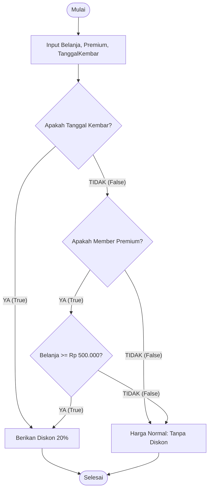

# Pertemuan 4: Penerapan Logika dalam Algoritma dan Pemrograman

Selamat datang di Pertemuan 4! 🚀
Setelah mendalami dasar-dasar logika secara teoretis pada tiga pertemuan awal, sekarang saatnya kita menjawab pertanyaan besar: *"Bagaimana matematika ini bekerja secara nyata di dalam kode program kita?"*

Dalam pemrograman, logika adalah kemudi dari seluruh aliran data. Tanpanya, kode kita akan berjalan lurus tanpa arah, menabrak batasan memori, atau bahkan mengalami mati mendadak (*crash*). Hari ini kita akan membedah logika percabangan, trik evaluasi cepat (*short-circuit evaluation*), dan cara menulis algoritma yang kokoh menggunakan penalaran logis yang benar.

---

## 🎯 Tujuan Pembelajaran

Setelah menyelesaikan materi pada pertemuan ini, diharapkan kamu mampu:
1. **Menerjemahkan** pernyataan logika matematika ke dalam struktur percabangan (`if-else`, `switch-case`) pada pemrograman dengan tepat.
2. **Menjelaskan** prinsip kerja *Short-Circuit Evaluation* (`&&` dan `||`) dan manfaatnya dalam mencegah *runtime error*.
3. **Mendeteksi** kesalahan logika (*logical bug*) pada alur kode program melalui teknik *dry run* (penelusuran manual).
4. **Merancang** aturan keputusan logika kompleks untuk studi kasus sistem *E-Commerce*.

---

## 📚 1. Logika Percabangan: Tuas Pengendali Aliran Kode

Komputer mengeksekusi program baris demi baris dari atas ke bawah. Namun, program yang cerdas harus bisa mengambil rute yang berbeda berdasarkan kondisi tertentu.

### 💡 Ilustrasi Imajinatif
> **Refleksi:**
> * *Jika kode program adalah aliran air sungai, apa yang terjadi saat air menemui bendungan atau percabangan kanal?*

Bayangkan program komputermu seperti **sistem rel kereta api logistik**. 
Kereta membawa muatan barang (data) dan melaju kencang ke depan. Di sepanjang jalur rel, terdapat tuas pemindah jalur otomatis (`if` dan `else`). 

```
                                 +---[ Jalur Hujan ]---> Bawa Payung
                                 |
[ Kereta Data ] ===> [ Tuas Hujan? ]
                                 |
                                 +---[ Jalur Cerah ]---> Pakai Jaket
```

Tugas tuas ini adalah membaca muatan kereta:
* Jika muatan berkode `"HUJAN"`, tuas berpindah ke jalur kiri $\rightarrow$ kereta diarahkan ke depo *"Bawa Payung"*.
* Jika muatan berkode apa saja selain itu (`else`), tuas berpindah ke jalur kanan $\rightarrow$ kereta diarahkan ke depo *"Pakai Jaket"*.

Tanpa adanya tuas ini, kereta akan menabrak dinding pembatas atau terperosok ke dalam jurang jika kondisi jalan di depan berubah.

### 🔍 Penjelasan Konsep dalam Sintaksis Kode
Dalam bahasa pemrograman seperti JavaScript, Java, C++, atau Python, tuas rel tersebut ditulis menggunakan struktur `if-else`.

```javascript
// Contoh implementasi logika percabangan dalam Javascript
let nilaiMahasiswa = 85;

if (nilaiMahasiswa >= 80) {
    console.log("Nilai Anda: A (Sangat Baik)");
} else if (nilaiMahasiswa >= 70) {
    console.log("Nilai Anda: B (Baik)");
} else {
    console.log("Nilai Anda: C (Cukup, Silakan Belajar Lebih Giat)");
}
```

Setiap kondisi di dalam kurung `(nilaiMahasiswa >= 80)` adalah pernyataan proposisi yang dievaluasi oleh komputer menjadi `TRUE` atau `FALSE`. Komputer hanya akan mengeksekusi blok kode di dalam kurung kurawal `{ ... }` jika pernyataan proposisi tersebut menghasilkan nilai `TRUE`.

---

## 📚 2. Short-Circuit Evaluation: Strategi Berpikir Cepat Komputer

Saat menggabungkan banyak kondisi menggunakan operator `AND` (`&&`) atau `OR` (`||`), komputer menggunakan trik malas yang sangat cerdas: ia tidak akan mengecek kondisi kedua jika kondisi pertama sudah cukup untuk menentukan hasil akhir. Trik ini disebut **Short-Circuit Evaluation** (Evaluasi Jalan Pintas).

### 💡 Ilustrasi Imajinatif
> **Refleksi:**
> * *Bayangkan kamu adalah petugas pemeriksa tiket bioskop yang sangat malas namun patuh aturan.*

* **Jalan Pintas AND (`&&`):**
  Aturan bioskop: *"Kamu boleh masuk jika punya Tiket ($p$) **DAN** memakai Masker ($q$)"*.
  Ketika pengunjung pertama datang dan berkata *"Saya tidak punya tiket"* (Premis $p$ bernilai **FALSE**), apa yang kamu lakukan? Sebagai petugas yang cerdas, kamu akan langsung mengusirnya tanpa perlu membuang waktu memeriksa apakah dia memakai masker atau tidak. Karena apapun status maskernya, dia **pasti tidak boleh masuk** ($F \land q \equiv F$).
* **Jalan Pintas OR (`||`):**
  Aturan bioskop gratis: *"Kamu boleh masuk jika membawa Undangan VIP ($p$) **ATAU** merupakan Anggota Pers ($q$)"*.
  Ketika pengunjung datang dan menunjukkan kartu VIP (Premis $p$ bernilai **TRUE**), kamu langsung mempersilakannya masuk tanpa perlu repot-repot bertanya apakah dia seorang wartawan pers atau bukan. Karena satu kondisi terpenuhi sudah cukup untuk membuat hasil akhirnya menjadi **TRUE** ($T \lor q \equiv T$).

### 🔍 Pentingnya Short-Circuit untuk Mencegah Crash (Logical Bug)

Dalam coding praktis, trik jalan pintas ini sangat krusial untuk menghindari error fatal seperti `NullPointerException` atau `Division by Zero`.

Mari kita lihat perbandingan kode berikut:

**⚠️ Kode yang Berbahaya (Tanpa Proteksi):**
```javascript
// Jika variabel 'user' ternyata kosong (null), baris ini akan langsung CRASH!
if (user.isActive === true && user !== null) {
    console.log("Akses diberikan.");
}
```
*Kenapa crash?* Karena komputer mengevaluasi dari kiri ke kanan. Ia mencoba membaca properti `isActive` dari objek `user` yang bernilai `null` (kosong). Ini memicu error fatal.

**  Kode yang Aman (Menggunakan Short-Circuit):**
```javascript
// Jika 'user' null, komputer langsung BERHENTI mengecek dan menghasilkan FALSE.
if (user !== null && user.isActive === true) {
    console.log("Akses diberikan.");
}
```
*Mengapa aman?* Karena jika `user !== null` bernilai **FALSE** (artinya `user` memang `null`), komputer langsung melakukan *short-circuit* (jalan pintas). Ia langsung menyimpulkan hasil akhirnya adalah `FALSE` dan mengabaikan bagian kanan `user.isActive`. Program pun berjalan mulus tanpa crash!

---

## 🛠️ Studi Kasus Informatika: Sistem Diskon Pintar E-Commerce

Sebuah toko online ingin menerapkan sistem diskon otomatis pada keranjang belanja pengguna. Mari kita analisis aturan bisnisnya menggunakan logika matematika!

### Aturan Bisnis:
Pelanggan berhak mendapatkan diskon sebesar 20% (`dapatDiskon = True`) jika:
1. Pelanggan memiliki status member PREMIUM (`isPremium = True`), **DAN** total belanja minimal Rp 500.000 (`belanjaOK = True`).
2. **ATAU**, jika hari ini adalah festival promo belanja bulanan tanggal kembar seperti 11.11 atau 12.12 (`isTanggalKembar = True`).

### Struktur Logika Matematika:
$$\text{dapatDiskon} = (\text{isPremium} \land \text{belanjaOK}) \lor \text{isTanggalKembar}$$

### Flowchart Algoritma Pemrograman:



### Implementasi Kode Program (JavaScript):
```javascript
function hitungTotal(totalBelanja, isPremium, isTanggalKembar) {
    const belanjaOK = totalBelanja >= 500000;
    
    // Mengevaluasi aturan logika matematika
    if (isTanggalKembar || (isPremium && belanjaOK)) {
        console.log("Selamat! Anda mendapatkan diskon 20% 🎉");
        return totalBelanja * 0.8;
    } else {
        console.log("Harga normal diterapkan.");
        return totalBelanja;
    }
}

// Uji Coba Fungsi
console.log(hitungTotal(600000, true, false)); // Output: 480000 (Premium & Belanja > 500k)
console.log(hitungTotal(150000, false, true)); // Output: 120000 (Bukan premium tapi Tanggal Kembar)
console.log(hitungTotal(200000, true, false)); // Output: 200000 (Premium tapi belanja kurang dari 500k)
```

---

## 📝 Latihan Soal & Asah Computational Thinking

### 🧠 Soal 1: Analisis Hasil Output Kode
Perhatikan potongan kode program di bawah ini dengan saksama:
```javascript
let A = true;
let B = false;
let C = true;

let hasil = (A && B) || (C && !B);
```
Berapakah nilai akhir dari variabel `hasil`? **TRUE** atau **FALSE**? Tuliskan langkah penelusuran evaluasimu langkah demi langkah!

### 💻 Soal 2: Menemukan Bug (Debugging Challenge)
Perhatikan fungsi JavaScript untuk mengecek kelayakan peminjaman buku perpustakaan berikut:
```javascript
function cekKelayakanPinjam(user) {
    // BUG: Kode di bawah ini sering memicu error ketika 'user' tidak terdaftar (null)
    if (user.jumlahPinjam < 3 && user !== null) {
        return "Boleh Pinjam";
    } else {
        return "Ditolak";
    }
}
```
1. Jelaskan mengapa kode di atas mengandung *logical bug* yang bisa membuat program crash!
2. Tuliskan perbaikan kode tersebut agar aman dari crash menggunakan teknik *short-circuit evaluation*!

### 🛠️ Soal 3: Merancang Logika Autopilot Smart Gate
Kamu ditugaskan merancang gerbang otomatis untuk jalan tol (*Smart Toll Gate*). Gerbang akan membuka (`bukaGerban = True`) jika dan hanya jika:
* Kendaraan mendeteksi kartu e-toll terpasang (`kartuTerdeteksi = True`) **DAN** saldo kartu minimal Rp 10.000 (`saldoCukup = True`).
* **ATAU**, jika petugas gerbang menekan tombol darurat manual (`tombolDarurat = True`).

Buatlah rancangan aturan logika ini dalam bentuk **Pseudocode** dan **Flowchart** yang jelas!

---

## 📌 Kesimpulan

Logika matematika adalah nyawa dari algoritma pemrograman. Pemahaman yang kuat tentang bagaimana komputer mengevaluasi ekspresi biner, menghemat waktu lewat *short-circuiting*, dan membagi jalur eksekusi lewat percabangan `if-else` adalah bekal paling utama bagi seorang pengembang sistem untuk menciptakan perangkat lunak yang andal, cepat, dan bebas dari error fatal.

> *"Menulis kode tanpa pemahaman logika yang kuat seperti merakit mobil sport yang kencang namun tanpa kemudi dan rem."*

Sampai jumpa di **Pertemuan 5**, di mana kita akan mulai menjelajahi dunia struktur pengelompokan data lewat **Teori Himpunan**! 🚀

---
*(buat pesan commit bahasa indonesia sederhana: "menambahkan materi kuliah pertemuan 4 tentang logika dalam pemrograman")*
