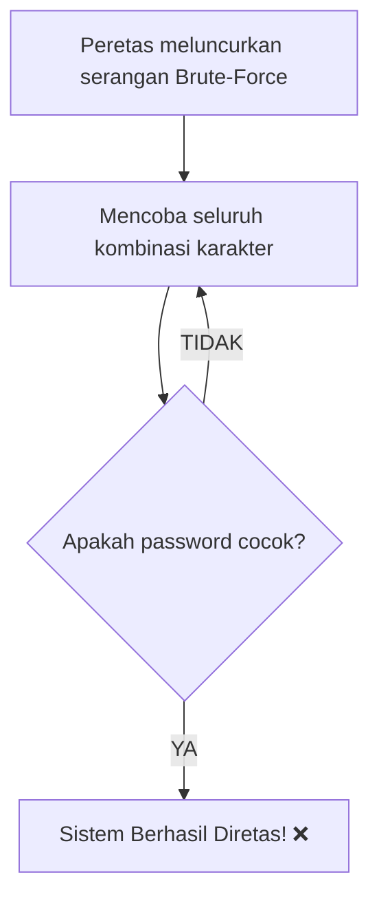

# Pertemuan 7: Kombinatorika Dasar dan Teknik Perhitungan

Selamat datang di Pertemuan 7! 🚀
Pernahkah kamu memikirkan bagaimana sebuah sistem e-commerce membuat jutaan kode voucher unik seperti `PROMO12A` tanpa pernah takut kodenya habis atau bertabrakan? Atau pernahkah kamu penasaran mengapa pakar keamanan siber menyarankan kita membuat password minimal 12 karakter dengan campuran huruf dan angka?

Di balik semua perhitungan kemungkinan itu, terdapat sebuah ilmu matematika diskrit bernama **Kombinatorika**. Hari ini kita akan mempelajari teknik-teknik dasar perhitungan kemungkinan susunan objek—mulai dari Aturan Penjumlahan dan Perkalian, hingga formula sakti **Permutasi** dan **Kombinasi**—serta penerapannya untuk mengukur ketahanan keamanan sistem komputer dari serangan peretas (*brute-force defense*).

---

## 🎯 Tujuan Pembelajaran

Setelah menyelesaikan materi pada pertemuan ini, diharapkan kamu mampu:
1. **Menerapkan** Aturan Penjumlahan (*Rule of Sum*) dan Aturan Perkalian (*Rule of Product*) dalam menyelesaikan kasus perhitungan kemungkinan secara tepat.
2. **Membedakan** antara Permutasi (di mana urutan objek penting) dengan Kombinasi (di mana urutan objek diabaikan) secara kritis.
3. **Menghitung** nilai Permutasi dan Kombinasi menggunakan rumus faktorial secara mandiri.
4. **Menganalisis** kekuatan keamanan password/enkripsi berdasarkan total kemungkinan kombinasi karakter (*computational complexity*).

---

## 📚 1. Aturan Dasar Menghitung: Penjumlahan vs Perkalian

Sebelum kita masuk ke rumus yang lebih kompleks, kita harus memahami dua aturan dasar menghitung yang sangat intuitif.

### 💡 Ilustrasi Imajinatif
> **Refleksi:**
> * *Jika kamu sedang berdiri di depan lemari pakaian, bagaimana caramu menghitung pilihan outfit?*

Bayangkan kamu sedang bersiap-siap untuk menghadiri kuliah pagi ini. Di lemarimu terdapat **3 buah Kaos Oblong** bergambar maskot IT dan **2 buah Kemeja Rapi**.

#### 1. Aturan Penjumlahan (Pilihan Saling Lepas - "ATAU")
Kamu hanya ingin memakai **satu buah baju** saja (tidak mungkin memakai kaos ditumpuk kemeja sekaligus). 
* Pilihanmu bersifat saling lepas (kamu harus memilih kaos **ATAU** kemeja).
* Total cara memilih baju = $\text{Jumlah Kaos} + \text{Jumlah Kemeja} = 3 + 2 = \mathbf{5}$ **cara**.

#### 2. Aturan Perkalian (Pilihan Berurutan/Bersamaan - "DAN")
Sekarang, kamu harus memilih **satu buah baju** (dari 3 kaos) **DAN** **satu buah celana** (kamu memiliki 2 celana jeans).
* Kamu harus memakai baju dan celana bersamaan untuk pergi kuliah.
* Total set pakaian unik yang bisa kamu susun = $\text{Jumlah Baju} \times \text{Jumlah Celana} = 3 \times 2 = \mathbf{6}$ **pasang pakaian**.

```
Baju: { Kaos 1, Kaos 2, Kaos 3 }
Celana: { Jeans Hitam, Jeans Biru }

Kombinasi:
Kaos 1 + Jeans Hitam      Kaos 2 + Jeans Hitam      Kaos 3 + Jeans Hitam
Kaos 1 + Jeans Biru       Kaos 2 + Jeans Biru       Kaos 3 + Jeans Biru
(Total 6 Pilihan)
```

---

## 📚 2. Permutasi vs Kombinasi: Urutan adalah Kunci!

Saat kita memilih sekelompok objek dari wadah yang besar, kita harus selalu bertanya: *"Apakah urutan memilih objek tersebut memengaruhi hasil akhirnya?"*

### 💡 Ilustrasi Imajinatif
> **Refleksi:**
> * *Apa perbedaan antara memasukkan nomor PIN smartphone dengan memilih hero di dalam game?*

#### 1. Permutasi: Urutan Sangat Penting! 🔑
Bayangkan **PIN keamanan smartphone milikmu yang terdiri dari 4 digit**.
Jika PIN aslimu adalah `1-2-3-4`, dan kamu mencoba memasukkan angka `4-3-2-1`, apakah HP-mu akan terbuka? Tentu **TIDAK**. Meskipun angka penyusunnya sama persis, karena urutan pengetikan salah, sistem keamanannya menolak. 
> **Definisi:** Permutasi adalah penyusunan kembali sekelompok objek di mana **urutan posisi sangat penting**.
* Rumus Permutasi $r$ objek dari $n$ objek:
  $$P(n, r) = \frac{n!}{(n-r)!}$$
  *(Ingat: $n!$ atau Faktorial adalah perkalian berurutan menurun: $n \times (n-1) \times (n-2) \dots \times 1$)*

#### 2. Kombinasi: Urutan Tidak Penting! 🎭
Bayangkan kamu sedang bermain game **Mobile Legends** bersama teman-temanmu. Kamu ditugaskan untuk memilih **3 hero pertama** yang akan dimasukkan ke dalam tim dari 5 hero yang tersedia.
Apakah ada perbedaan jika kamu memilih `[Mage, Tank, Marksman]` dengan kamu memilih `[Marksman, Tank, Mage]`? **TIDAK**. Komposisi tim akhir yang terbentuk tetap sama persis, tidak peduli siapa yang kamu klik duluan.
> **Definisi:** Kombinasi adalah pemilihan sekelompok objek di mana **urutan pemilihannya diabaikan**.
* Rumus Kombinasi $r$ objek dari $n$ objek:
  $$C(n, r) = \binom{n}{r} = \frac{n!}{r!(n-r)!}$$

---

## 🛠️ Studi Kasus Informatika: Analisis Kekuatan Password & Brute-Force Defense

Mengapa pakar keamanan siber melarang kita menggunakan password yang pendek seperti `123` atau `abc`? Mari kita hitung kekuatannya secara matematis menggunakan kombinatorika!



### Kasus Skenario:
Sebuah sistem login membatasi password hanya boleh terdiri dari **angka (0-9)**. Jumlah total karakter angka yang tersedia adalah 10 karakter.

1. **Password Panjang 4 Karakter (Hanya Angka):**
   * Setiap digit password memiliki 10 kemungkinan pilihan (0 sampai 9).
   * Berdasarkan Aturan Perkalian, total kombinasi password unik yang bisa dibuat adalah:
     $$\text{Total Kombinasi} = 10 \times 10 \times 10 \times 10 = 10^4 = \mathbf{10.000} \text{ kemungkinan.}$$
   * Komputer modern mampu menebak **1.000.000 kombinasi per detik**. 
   * Waktu maksimal yang dibutuhkan peretas untuk membongkar password-mu:
     $$\text{Waktu} = \frac{10.000}{1.000.000} = \mathbf{0,01} \text{ detik! (Instan! ⚡)}$$

2. **Password Panjang 8 Karakter (Campuran Angka, Huruf Kecil, dan Huruf Besar):**
   * Jumlah karakter tersedia: Angka (10), Huruf Kecil (26), Huruf Besar (26). Total = 62 karakter unik.
   * Berdasarkan Aturan Perkalian, total kombinasi password 8 karakter:
     $$\text{Total Kombinasi} = 62^8 = \mathbf{218.340.105.584.896} \text{ kemungkinan.}$$
   * Waktu maksimal yang dibutuhkan komputer peretas yang sama:
     $$\text{Waktu} = \frac{218.340.105.584.896}{1.000.000} \approx 218.340.105 \text{ detik} \approx \mathbf{6,9} \text{ tahun!}$$

Perhatikan betapa luar biasanya peningkatan keamanan hanya dengan menambah panjang karakter dan jenis variasinya! Matematika kombinatorika memberikan bukti ilmiah di balik aturan keamanan password modern.

---

## 📝 Latihan Soal & Asah Computational Thinking

### 🧠 Soal 1: Penerapan Aturan Dasar
Sebuah program generator kode promo ingin membuat kode voucher unik yang terdiri dari **3 huruf kapital** (A-Z) diikuti oleh **2 angka** (0-9).
1. Berapakah total kode voucher unik yang bisa dibuat jika huruf dan angka **boleh berulang** (misal: `AAA11`)?
2. Berapakah total kode voucher unik yang bisa dibuat jika huruf dan angka **tidak boleh berulang** (misal: `ABC12`)?

### 📝 Soal 2: Menghitung Permutasi dan Kombinasi
Tunjukkan langkah perhitungan manualmu untuk kasus berikut:
1. Hitunglah nilai dari $P(6, 3)$ dan $C(6, 3)$!
2. Di sebuah kelas yang berisi **8 orang mahasiswa**, akan dipilih **3 orang** untuk menjadi tim panitia inti acara hackathon. Berapakah banyak cara memilih panitia tersebut? (Petunjuk: Apakah posisi panitia memiliki jabatan spesifik yang memengaruhi urutan?)
3. Di kelas yang sama, akan dipilih **3 orang** untuk menduduki jabatan sebagai Ketua, Sekretaris, dan Bendahara. Berapakah banyak cara menyusun kepengurusan tersebut?

### 💻 Soal 3: Studi Kasus Kompleksitas brute-force Enkripsi 
Sebuah sistem keamanan menggunakan enkripsi kunci 5 karakter alfanumerik (hanya kombinasi huruf kecil a-z dan angka 0-9). 
1. Tuliskan rumus matematika untuk menghitung total kemungkinan kunci enkripsi tersebut!
2. Jika kecepatan mesin dekripsi penyerang adalah 50.000 tebakan per detik, berapa jam waktu maksimal yang ia perlukan untuk menebak kunci tersebut?

---

## 📌 Kesimpulan

Kombinatorika adalah ilmu dasar untuk mengukur kompleksitas komputasi. Mulai dari menguji seberapa kuat keamanan enkripsi data, memperkirakan kapasitas alokasi nomor IP, hingga merancang algoritma game berbasis pencarian probabilitas jalan terbaik—semuanya menggunakan prinsip aturan perkalian, permutasi, dan kombinasi. Memahami teknik perhitungan ini membantu kita menjadi pengembang sistem yang mampu mengukur risiko keamanan secara kuantitatif.

> *"Keamanan siber bukanlah tentang membuat sistem yang 100% mustahil ditembus, melainkan membuat jumlah kemungkinan kombinasi kunci menjadi begitu besar sehingga peretas kehabisan waktu sebelum berhasil membongkarnya."*

Selamat! Kamu telah menyelesaikan setengah perjalanan semester ini. Bersiaplah untuk mengevaluasi seluruh pemahamanmu di **Pertemuan 8 (Ujian Tengah Semester)**! 🏁

---
*(buat pesan commit bahasa indonesia sederhana: "menambahkan materi kuliah pertemuan 7 tentang kombinatorika dasar")*
