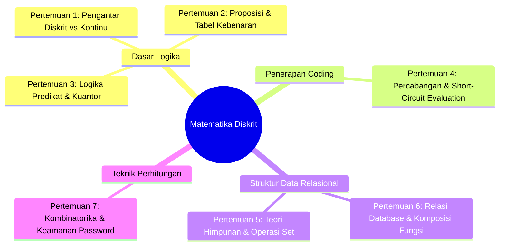

# Pertemuan 8: Ujian Tengah Semester (UTS) - Panduan & Simulasi Mandiri

Selamat! Kamu telah berhasil menempuh setengah perjalanan perkuliahan Matematika Diskrit. 🏁
Ujian Tengah Semester (UTS) bukanlah sebuah momok menakutkan yang dirancang untuk menjatuhkan nilaimu. Sebaliknya, UTS adalah sebuah stasiun checkpoint yang sangat berharga untuk mengukur sejauh mana otakmu telah terlatih berpikir secara logis, terstruktur, dan komputasional. 

Dokumen ini disusun sebagai panduan persiapan belajar komprehensif, rangkuman materi dari Pertemuan 1 hingga 7, serta lembar simulasi soal ujian mandiri agar kamu benar-benar siap menghadapi evaluasi akademis yang sesungguhnya.

---

## 🎯 Tujuan Evaluasi (Tujuan Pembelajaran)

Melalui Ujian Tengah Semester ini, diharapkan kamu mampu:
1. **Merefleksikan** kembali konsep dasar perbedaan dunia kontinu dan diskrit serta perannya dalam ilmu komputer.
2. **Mengevaluasi** validitas pernyataan logika proposisional dan logika predikat menggunakan tabel kebenaran dan hukum penalaran.
3. **Mengaitkan** operasi himpunan, relasi database, dan pipeline fungsi dengan struktur data pada pemrograman.
4. **Memecahkan** masalah perhitungan probabilitas dan kompleksitas kunci keamanan sistem menggunakan teknik kombinatorika.

---

## 📚 1. Peta Rangkuman Materi (Pertemuan 1 - 7)

Mari kita segarkan ingatan kita dengan peta konsep dari materi-materi yang telah kita pelajari sebelumnya:

* **Pertemuan 1:** Perbedaan dunia diskrit (terpisah, anak tangga, digital) vs kontinu (mengalir, perosotan, analog). Hubungan matematika diskrit sebagai bahasa ibu bagi komputer yang biner (`0` dan `1`).
* **Pertemuan 2:** Proposisi (pernyataan bernilai True/False mutlak) dan 6 operator logika dasar (AND, OR, NOT, XOR, Implikasi, Biimplikasi) serta visualisasi tabel kebenaran.
* **Pertemuan 3:** Logika Predikat ($P(x)$) dan Kuantor Universal ($\forall$ - semua) serta Eksistensial ($\exists$ - ada). Hukum penarikan kesimpulan: Modus Ponens, Modus Tollens, dan Silogisme.
* **Pertemuan 4:** Struktur `if-else` dan konsep *Short-Circuit Evaluation* (`&&` dan `||`) untuk mencegah program crash akibat `NullPointerException`.
* **Pertemuan 5:** Teori Himpunan (Union, Intersection, Difference, Complement, Venn Diagram) dan implementasi objek `Set` di JavaScript untuk pembersihan duplikasi data secara instan.
* **Pertemuan 6:** Relasi (One-to-One, One-to-Many, Many-to-Many pada database SQL) dan Fungsi (Domain, Kodomain, Range) serta Komposisi Fungsi $(f \circ g)(x)$ untuk pipeline data.
* **Pertemuan 7:** Kombinatorika dasar (Aturan Penjumlahan & Perkalian), rumus Permutasi (urutan penting, PIN HP) vs Kombinasi (urutan diabaikan, pemilihan hero game), serta analisis kekuatan keamanan enkripsi password.

---

## 💡 2. Ilustrasi Imajinatif: Ujian sebagai "Final Boss Battle"

> **Refleksi:**
> * *Jika ujian adalah sebuah adegan di dalam game RPG (Role-Playing Game), apa yang sedang terjadi?*
> * *Bagaimana caramu mempersiapkan karakter pahlawanmu agar bisa menang?*

Bayangkan UTS ini seperti sebuah **Final Boss Battle (Pertempuran Melawan Raja Terakhir)** di dalam game petualangan RPG favoritmu:
* **Boss (Ujian):** Memiliki serangan-serangan tak terduga berupa teka-teki logika yang terlihat rumit dan memiliki tameng pertahanan yang kuat.
* **Senjata & Armor (Materi Kuliah):** Setiap pertemuan yang telah kamu pelajari adalah *equipment* berhargamu. Logika Proposisional adalah pedang tajammu, Teori Himpunan adalah perisaimu, dan Kombinatorika adalah ramuan penambah kekuatan serangmu.
* **Strategi Bertempur (Computational Thinking):** Kamu tidak akan bisa mengalahkan boss hanya dengan menebas tombol secara asal-asalan (menghafal rumus kering). Kamu harus membaca pola serangan boss, memecah masalah besar menjadi bagian-bagian kecil (dekomposisi), dan menyerang titik lemahnya menggunakan taktik logika yang presisi.

Ketika kamu melihat ujian sebagai arena bermain untuk menguji kekuatan karaktermu, rasa takut itu akan berubah menjadi antusiasme untuk menang!

---

## 🔍 3. Contoh Sederhana: Tips Membedakan Permutasi vs Kombinasi di Ujian

Salah satu kesalahan paling umum mahasiswa saat UTS adalah tertukar dalam menentukan kapan harus menggunakan rumus Permutasi dan kapan harus menggunakan Kombinasi. 

**Mari kita lihat trik cepatnya:**

* **Kasus A:** *"Dari 5 mahasiswa, dipilih 3 orang untuk menjadi perwakilan lomba."*
  * *Uji Urutan:* Jika terpilih Budi, Cici, dan Deni, apakah status mereka berbeda jika disebut Deni, Cici, dan Budi? **TIDAK**. Mereka bertiga tetap satu kelompok setara yang pergi lomba bersama.
  * *Keputusan:* Urutan tidak penting $\rightarrow$ Gunakan **Kombinasi** $C(5, 3)$.

* **Kasus B:** *"Dari 5 mahasiswa, dipilih 3 orang untuk menjadi Ketua, Sekretaris, dan Bendahara."*
  * *Uji Urutan:* Jika Budi jadi Ketua, Cici Sekretaris, dan Deni Bendahara, apakah sama jika Deni yang jadi Ketua, Cici Sekretaris, dan Budi Bendahara? **TENTU BEDA**. Tanggung jawab dan jabatan mereka berubah total.
  * *Keputusan:* Urutan sangat penting $\rightarrow$ Gunakan **Permutasi** $P(5, 3)$.

---

## 🛠️ 4. Studi Kasus Informatika: Audit Logika Pintu Otomatis Server Room

Sebuah ruang server pusat data dilindungi oleh pintu keamanan otomatis yang dikendalikan oleh mikrokontroler. Pintu hanya akan terbuka (`Open = True`) jika memenuhi kondisi logika berikut:
1. Kartu akses staf ditempelkan (`Card = True`) **DAN** sidik jari staf cocok (`Fingerprint = True`).
2. **ATAU**, jika sensor kebakaran tidak mendeteksi asap (`Smoke = False`) **DAN** tombol darurat ditekan dari dalam ruangan (`Emergency = True`).

### Ekspresi Logika Boolean:
$$\text{Open} = (\text{Card} \land \text{Fingerprint}) \lor (\neg\text{Smoke} \land \text{Emergency})$$

### Kasus Kegagalan Audit:
Saat dilakukan audit keamanan, terjadi insiden di mana pintu terbuka sendiri padahal tidak ada staf yang menempelkan kartu akses ataupun sidik jari.
* **Data Log Sensor:** `Card = False`, `Fingerprint = False`, `Smoke = False`, `Emergency = True`.
* **Evaluasi Audit secara Logis:**
  $$\text{Open} = (F \land F) \lor (\neg F \land T)$$
  $$\text{Open} = F \lor (T \land T)$$
  $$\text{Open} = F \lor T = \mathbf{TRUE}$$
* **Hasil Kesimpulan:** Secara matematis, sistem pintu bekerja dengan benar sesuai spesifikasi logika yang dirancang. Masalahnya bukan pada kerusakan sirkuit fisik pintu, melainkan pada aturan logika bisnis: menekan tombol darurat dari dalam saat tidak ada asap tetap membuka pintu meskipun tidak ada kartu akses terverifikasi.

---

## 📝 5. Lembar Simulasi Mandiri Soal UTS Matematika Diskrit

Sediakan kertas dan alat tulis. Kerjakan simulasi ujian ini dalam waktu **90 menit** tanpa melihat buku catatan!

### BAGIAN A: SOAL PILIHAN GANDA (Bobot: 30%)
1. Manakah di antara kalimat berikut yang merupakan proposisi yang bernilai **Salah**?
   * a. "Apakah Python adalah bahasa pemrograman?"
   * b. "$3 + 5 = 9$"
   * c. "Semoga Anda lulus UTS dengan nilai A."
   * d. "Hari ini hujan lebat di kampus."

2. Ekspresi logika $\neg(p \lor q)$ secara logis ekuivalen dengan...
   * a. $\neg p \lor \neg q$
   * b. $\neg p \land \neg q$
   * c. $p \land q$
   * d. $\neg p \rightarrow q$

3. Dalam pemrograman JavaScript, baris kode `if (user !== null && user.age > 18)` menggunakan teknik evaluasi apa untuk mencegah crash?
   * a. Short-Circuit Evaluation
   * b. Binary Search Logic
   * c. Logical Implication
   * d. Predicate Logic

4. Jika Himpunan $A = \{1, 2, 3, 4\}$ dan Himpunan $B = \{3, 4, 5, 6\}$, berapakah nilai dari Beda Setangkup $A \oplus B$?
   * a. $\{3, 4\}$
   * b. $\{1, 2, 5, 6\}$
   * c. $\{1, 2, 3, 4, 5, 6\}$
   * d. $\emptyset$

5. Berapakah banyak cara menyusun password 5 digit yang **hanya terdiri dari angka ganjil** dan **tidak boleh ada angka yang berulang**?
   * a. $5^5 = 3125$
   * b. $P(5, 5) = 120$
   * c. $C(5, 5) = 1$
   * d. $P(10, 5) = 30240$

---

### BAGIAN B: SOAL ESSAY & ANALISIS LOGIKA (Bobot: 70%)

#### Soal 1: Logika Predikat & Kuantor (Bobot: 20%)
Diberikan predikat $P(x)$ : "$x$ adalah aplikasi open-source" dan $Q(x)$ : "$x$ ditulis dalam bahasa JavaScript". Domain pembicaraan adalah seluruh perangkat lunak di dunia.
1. Terjemahkan pernyataan simbolik berikut ke dalam kalimat bahasa Indonesia yang mengalir:
   * a. $\forall x (P(x) \rightarrow Q(x))$
   * b. $\exists x (P(x) \land \neg Q(x))$
2. Berikan satu contoh nyata perangkat lunak yang bertindak sebagai *counterexample* (penyangkal) untuk membuat pernyataan 1.a bernilai **Salah**!

#### Soal 2: Teori Himpunan & Diagram Venn (Bobot: 25%)
Di sebuah perusahaan rintisan (*startup*) teknologi yang memiliki **80 karyawan**:
* **45 karyawan** mahir dalam pemrograman Front-End (React/Vue).
* **40 karyawan** mahir dalam pemrograman Back-End (Node.js/Go).
* **15 karyawan** mahir di kedua bidang tersebut (Full-Stack).
1. Buatlah gambar Diagram Venn secara lengkap dan terstruktur!
2. Berapakah jumlah karyawan yang **hanya** mahir Back-End?
3. Berapakah jumlah karyawan yang **tidak mahir di kedua bidang tersebut** (misalnya bagian HRD atau Desainer UI)?

#### Soal 3: Komposisi Fungsi & Pipeline Data (Bobot: 25%)
Dua fungsi pemrosesan teks didefinisikan sebagai berikut:
* $g(x) = \text{"Selamat Datang " + } x$ (Menambahkan kata sapaan di depan nama user)
* $f(x) = \text{mengubah seluruh string } x \text{ menjadi huruf kapital (UPPERCASE)}$

1. Tuliskan rumus komposisi fungsi $(f \circ g)(x)$!
2. Jika input nama user $x = \text{"nasir usman"}$, tentukan output akhir dari $(f \circ g)(\text{"nasir usman"})$!
3. Apakah urutan eksekusi fungsi berpengaruh? Hitunglah $(g \circ f)(\text{"nasir usman"})$ untuk membuktikannya!

---

## 📌 Kesimpulan

Ujian Tengah Semester adalah cermin refleksi dari latihan mental berpikir komputasional yang telah kamu lakukan selama setengah semester ini. Kuasai dasar konsepnya, gambarkan analogi imajinatifnya di dalam pikiranmu, dan kerjakan setiap soal dengan ketenangan logika yang pasti.

> *"Logika adalah cahaya pemandu di dalam kegelapan ketidakpastian. Tenang, teliti, dan biarkan kebenaran matematis menuntun jawabanmu."*

Selamat belajar dan semoga sukses mendapatkan nilai **A** pada UTS Matematika Diskrit! 🌟

---
*(buat pesan commit bahasa indonesia sederhana: "menambahkan materi kuliah pertemuan 8 tentang persiapan dan simulasi uts")*
