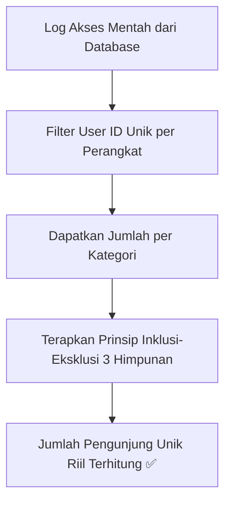

# Pertemuan 9: Prinsip Inklusi-Eksklusi

Selamat datang di Pertemuan 9! 🚀
Setelah melewati Ujian Tengah Semester, sekarang kita memasuki paruh kedua perkuliahan dengan energi baru. Hari ini kita akan membahas sebuah teknik penghitungan lanjut yang sangat penting dalam optimasi pencarian data dan analisis statistik: **Prinsip Inklusi-Eksklusi**.

Pernahkah kamu memikirkan bagaimana Google Analytics menghitung jumlah pengunjung unik (*unique visitors*) suatu website secara akurat, padahal ada pengguna yang mengakses web tersebut menggunakan HP, laptop, dan tablet secara bersamaan? Bagaimana caranya sistem menghindari penghitungan ganda (*double-counting*) agar datanya tidak menggelembung? Mari kita bedah rahasia matematikanya hari ini!

---

## 🎯 Tujuan Pembelajaran

Setelah menyelesaikan materi pada pertemuan ini, diharapkan kamu mampu:
1. **Menjelaskan** logika dasar di balik Prinsip Inklusi-Eksklusi untuk menghindari penghitungan ganda pada irisan himpunan.
2. **Menerapkan** rumus Inklusi-Eksklusi untuk 2 himpunan dalam memecahkan masalah kombinatorial dan teori bilangan sederhana.
3. **Menganalisis** kasus pencarian data kompleks menggunakan rumus Inklusi-Eksklusi untuk 3 himpunan secara presisi.
4. **Merancang** logika pemrosesan data analitik pengguna (*User Device Tracking*) pada sistem dashboard data.

---

## 📚 1. Logika Inklusi-Eksklusi: Menghindari Perangkap Hitung Ganda

Pada Pertemuan 5 kita sudah belajar tentang gabungan himpunan ($A \cup B$). Namun, bagaimana cara menghitung jumlah anggota (*kardinalitas*) dari gabungan tersebut jika kita hanya mengetahui jumlah anggota masing-masing himpunan secara terpisah?

### 💡 Ilustrasi Imajinatif
> **Refleksi:**
> * *Jika kamu memiliki dua lembar karpet yang diletakkan saling bertumpang tindih di atas lantai, bagaimana cara menghitung total luas lantai yang tertutup karpet?*

Bayangkan kamu memiliki dua buah karpet di lantai kamar belajarmu:
* Karpet Biru ($A$) memiliki luas 6 meter persegi.
* Karpet Merah ($B$) memiliki luas 4 meter persegi.

Jika kamu meletakkan kedua karpet tersebut saling bertumpukan sebagian di lantai (tumpang tindih), apakah total luas lantai yang tertutup karpet adalah $6 + 4 = 10$ meter persegi? **TENTU TIDAK**. 

```
Karpet A: [      ===|====== ]
                    | (Tumpang tindih / Irisan A ∩ B)
Karpet B:        [==|======      ]
```

Bagian lantai yang tertimpa oleh *kedua* karpet sekaligus (irisan $A \cap B$) telah dihitung dua kali: sekali saat mengukur Karpet A, dan sekali lagi saat mengukur Karpet B. 

Untuk mendapatkan luas yang benar, kita harus memasukkan (*inklusi*) seluruh luas Karpet A dan Karpet B, lalu mengeluarkan (*eksklusi*) satu kali luas area yang tumpang tindih tersebut agar adil.
$$\text{Luas Total} = \text{Luas A} + \text{Luas B} - \text{Luas A yang bertindih dengan B}$$

### 🔍 Penjelasan Konsep & Rumus Matematika

Prinsip Inklusi-Eksklusi adalah teknik kombinatorial untuk menghitung ukuran gabungan himpunan dengan menjumlahkan ukuran masing-masing himpunan (inklusi) lalu mengurangkan ukuran irisannya (eksklusi).

#### 1. Rumus untuk 2 Himpunan:
$$|A \cup B| = |A| + |B| - |A \cap B|$$

#### 2. Rumus untuk 3 Himpunan:
Bagaimana jika ada tiga karpet yang saling bertumpukan? Rumusnya berkembang menjadi:
$$|A \cup B \cup C| = |A| + |B| + |C| - |A \cap B| - |A \cap C| - |B \cap C| + |A \cap B \cap C|$$
*Penjelasan:* Kita tambahkan semua himpunan tunggal, kurangi semua irisan dua himpunan (karena dikurangi terlalu banyak), lalu tambahkan kembali irisan ketiga himpunan di bagian paling tengah agar nilainya pas kembali.

---

## 📚 2. Contoh Sederhana: Kasus Teori Bilangan

Mari kita uji rumus ini pada kasus matematika klasik: 
*Hitunglah berapa banyak bilangan bulat dari 1 sampai 100 yang habis dibagi 3 **atau** habis dibagi 5!*

### Langkah Penyelesaian:
Misalkan $S = \{1, 2, 3, \dots, 100\}$, maka jumlah anggota semesta $|S| = 100$.
* Himpunan $A$ (habis dibagi 3): Anggotanya $\{3, 6, 9, \dots, 99\}$.
  $$|A| = \lfloor 100 / 3 \rfloor = 33 \text{ bilangan.}$$
* Himpunan $B$ (habis dibagi 5): Anggotanya $\{5, 10, 15, \dots, 100\}$.
  $$|B| = \lfloor 100 / 5 \rfloor = 20 \text{ bilangan.}$$
* Himpunan $A \cap B$ (habis dibagi 3 **DAN** 5, artinya habis dibagi KPK-nya yaitu 15): Anggotanya $\{15, 30, 45, 60, 75, 90\}$.
  $$|A \cap B| = \lfloor 100 / 15 \rfloor = 6 \text{ bilangan.}$$

Gunakan rumus Inklusi-Eksklusi:
$$|A \cup B| = |A| + |B| - |A \cap B|$$
$$|A \cup B| = 33 + 20 - 6 = \mathbf{47} \text{ bilangan.}$$

Jadi, terdapat 47 bilangan di antara 1 sampai 100 yang habis dibagi 3 atau 5.

---

## 🛠️ Studi Kasus Informatika: Dashboard Analitik Pengguna Lintas Perangkat

Sebagai Web Analyst di Tokopedia, kamu diminta menyajikan data jumlah **Pengunjung Unik Nyata** yang masuk ke platform selama masa kampanye hari belanja nasional. Pengguna bisa mengakses platform lewat tiga jenis perangkat (*device*):
* Himpunan $M$: Mengakses lewat **Mobile App** (HP).
* Himpunan $D$: Mengakses lewat **Desktop Browser** (Laptop).
* Himpunan $T$: Mengakses lewat **Tablet App**.



### Data Statistik dari Server:
* Pengguna Mobile ($|M|$) = 50.000 user
* Pengguna Desktop ($|D|$) = 30.000 user
* Pengguna Tablet ($|T|$) = 10.000 user
* Pengguna Mobile & Desktop ($|M \cap D|$) = 8.000 user
* Pengguna Mobile & Tablet ($|M \cap T|$) = 3.000 user
* Pengguna Desktop & Tablet ($|D \cap T|$) = 2.000 user
* Pengguna yang memakai ketiga perangkat sekaligus ($|M \cap D \cap T|$) = 1.000 user

### Analisis Penghitungan Unik:
Jika kita langsung menjumlahkan totalnya ($50.000 + 30.000 + 10.000 = 90.000$), data ini salah besar karena menghitung ganda orang yang memiliki banyak perangkat. 

Mari kita hitung jumlah pengunjung unik nyata menggunakan rumus Inklusi-Eksklusi 3 Himpunan:
$$|M \cup D \cup T| = |M| + |D| + |T| - |M \cap D| - |M \cap T| - |D \cap T| + |M \cap D \cap T|$$
$$|M \cup D \cup T| = 50.000 + 30.000 + 10.000 - 8.000 - 3.000 - 2.000 + 1.000$$
$$|M \cup D \cup T| = 90.000 - 13.000 + 1.000 = \mathbf{78.000} \text{ pengunjung unik riil.}$$

Dengan perhitungan ini, dashboard perusahaan menyajikan data yang akurat dan kredibel untuk pengambilan keputusan bisnis pemasaran.

---

## 📝 Latihan Soal & Asah Computational Thinking

### 🧠 Soal 1: Matematika Bilangan
Di antara bilangan bulat dari 1 sampai 500:
1. Berapa banyak bilangan yang habis dibagi 4 atau habis dibagi 6?
2. Berapa banyak bilangan yang **TIDAK** habis dibagi 4 maupun 6? (Petunjuk: Gunakan komplemen gabungan terhadap semesta!)

### 📝 Soal 2: Kasus 3 Himpunan (Pencarian Minat Mahasiswa)
Di sebuah angkatan jurusan Sistem Informasi yang terdiri dari **120 mahasiswa**:
* **70 orang** menyukai mata kuliah *Basis Data*.
* **55 orang** menyukai mata kuliah *Pemrograman Web*.
* **45 orang** menyukai mata kuliah *Jaringan Komputer*.
* **25 orang** menyukai *Basis Data* dan *Pemrograman Web*.
* **20 orang** menyukai *Basis Data* dan *Jaringan Komputer*.
* **15 orang** menyukai *Pemrograman Web* dan *Jaringan Komputer*.
* **10 orang** menyukai ketiga-tiganya.

1. Berapakah jumlah mahasiswa yang menyukai setidaknya satu dari ketiga mata kuliah tersebut?
2. Berapakah jumlah mahasiswa yang **tidak menyukai satu pun** dari ketiga mata kuliah tersebut?

### 💻 Soal 3: Algoritma Pencarian Tag Artikel (Database Query)
Bayangkan kamu sedang memprogram mesin pencarian blog. Pengguna mencari artikel yang memiliki tag `"Programming"` ATAU tag `"AI"`.
* Artikel dengan tag `"Programming"` ($P$): `{ID_1, ID_2, ID_3, ID_4, ID_5}`
* Artikel dengan tag `"AI"` ($A$): `{ID_3, ID_4, ID_6, ID_7}`

Tuliskan langkah logika atau potongan kode sederhana dalam **JavaScript** atau **Python** untuk mendapatkan daftar ID artikel gabungan yang unik menggunakan prinsip inklusi-eksklusif agar ID artikel tidak muncul dua kali di layar hasil pencarian!

---

## 📌 Kesimpulan

Prinsip Inklusi-Eksklusi adalah senjata matematika yang sangat ampuh untuk mengoreksi bias data akibat tumpang tindih. Mulai dari penghitungan statistik bisnis, query database SQL yang menggabungkan banyak tabel dengan klausa `OR`, hingga perancangan mesin pencarian filter canggih—semuanya bergantung pada aturan pengurangan irisan ini. Menguasai konsep ini menjamin data yang kamu sajikan sebagai engineer selalu bersih dan valid.

> *"Menjumlahkan data tanpa membuang irisannya adalah ilusi angka yang menyesatkan. Matematika mengajarkan kita untuk presisi memisahkan tumpang tindih."*

Sampai jumpa di **Pertemuan 10**, di mana kita akan mulai berkenalan dengan struktur data paling populer di dunia IT: **Teori Graf**! ⚡

---
*(buat pesan commit bahasa indonesia sederhana: "menambahkan materi kuliah pertemuan 9 tentang prinsip inklusi eksklusi")*
